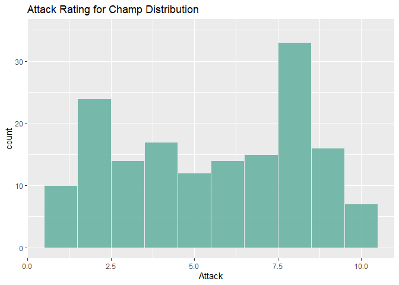
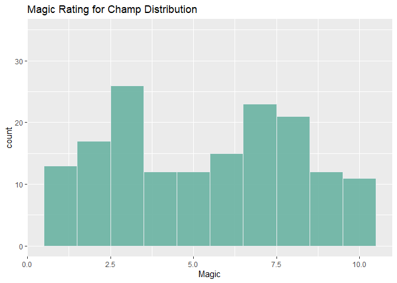
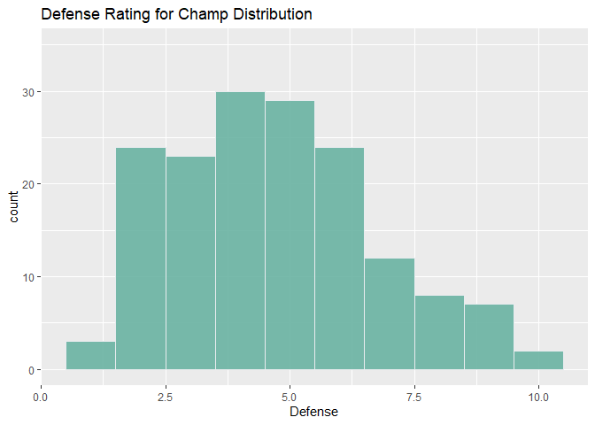
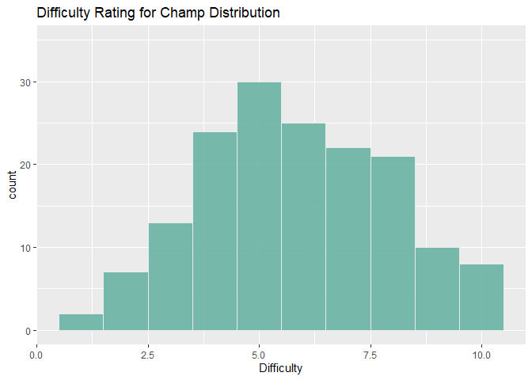
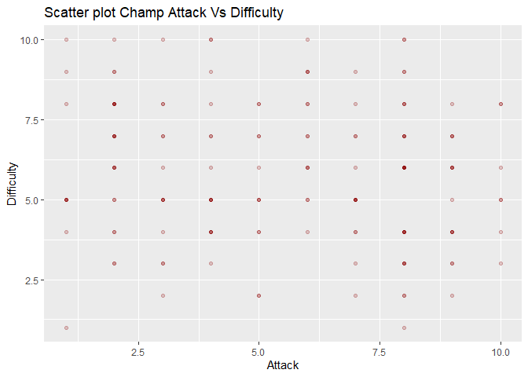
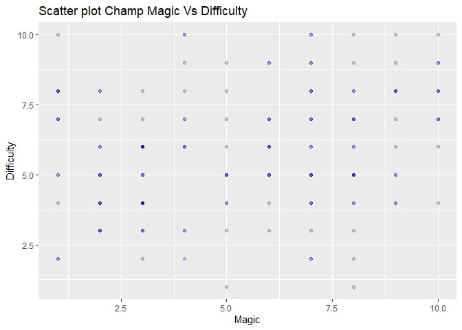
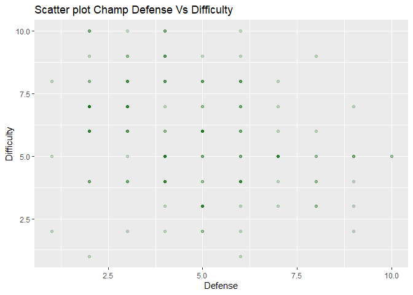
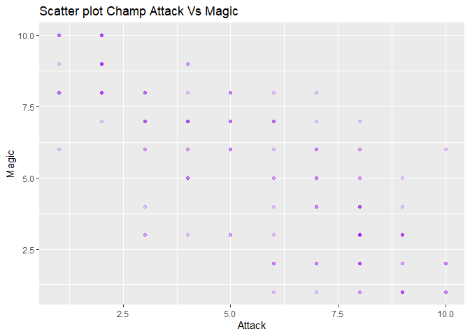

League Champ Recommender
================
Riley Ledezma
2023-02-01

- <a href="#1-background-and-motivation"
  id="toc-1-background-and-motivation">1 Background and Motivation</a>
- <a href="#2-the-data-etl" id="toc-2-the-data-etl">2 The Data ETL</a>
- <a href="#3-summary-of-champion-types"
  id="toc-3-summary-of-champion-types">3 Summary Of Champion Types</a>
- <a href="#4-visualization-on-each-category-by-champion"
  id="toc-4-visualization-on-each-category-by-champion">4 Visualization on
  Each Category By Champion</a>
- <a href="#5-clustering-champions-by-kmeans"
  id="toc-5-clustering-champions-by-kmeans">5 Clustering Champions by
  KMeans</a>
- <a href="#6-recommender" id="toc-6-recommender">6 Recommender</a>
- <a href="#7-conclusion" id="toc-7-conclusion">7 Conclusion</a>

# 1 Background and Motivation

       “Hey Riley, what champ do you think I’d be good at?” I’ve
received this question a lot from my friends who play League of Legends
and in the spirit of kindness (not exhaustion), I was curious to
construct a champion recommender. Using Riots champion data, I
constructed a K-means clustering model to help my fellow gamers pick a
new character to pick up. Below is a step-by-step guide how to build a
basic recommendation system for champion selection. In the future I will
use this schema to design a more rigorous model. At the end is a radar
chart to compare champions to each other and a link to the shiny app
which allows live manipulation of the data!

# 2 The Data ETL

## 2.1 Grabbing the Data from Riot

       Riot has a small JSON file with pretty up-to-date information on
every Champion (or Character) in League of Legends.

``` r
#Getting JSON from RIOT
getLoLChamps<- fromJSON("http://ddragon.leagueoflegends.com/cdn/13.1.1/data/en_US/champion.json")

#Transforming JSON into usable data
champData <- getLoLChamps$data

#Refine ChampData so it grabs all their stats easily
champPri <- data.frame()

for(i in 1:length(champData)){
  #Extract List
  current_list<- champData[[i]]
  current_df <- data.frame(current_list$name,current_list$info$attack,current_list$info$defense,current_list$info$magic,current_list$info$difficulty)
  
  #Append Data 
  champPri <- rbind(champPri, current_df)
}

#Change Column Names 

colnames(champPri) <- c("ChampName","Attack","Defense","Magic","Difficulty")
```

## 2.2 Data Cleaning

      &nbsp Within the Json file there are a few champions who have 0
values which do not makes sense (i.e Qiyana had 0 for attack). Since the
data set is relatively small I was able to make a few spot corrections
to the champions who I thought were off.

``` r
#fill in missing champ data 
replaceRows <- function(champion,attack,magic,defesne,diff){
  champPri[champPri$ChampName == champion,"Attack"] <- attack
  champPri[champPri$ChampName == champion,"Magic"] <- magic
  champPri[champPri$ChampName == champion,"Defense"] <- defesne
  champPri[champPri$ChampName == champion,"Difficulty"] <- diff
  return(champPri)
}

champPri <- replaceRows("Akshan",9,3,3,6)
champPri <- replaceRows("Qiyana",6,2,4,8)
champPri <- replaceRows("Vex",1,10,4,4)
champPri <- replaceRows("Lillia",2,10,2,8)
champPri <- replaceRows("Seraphine",3,7,4,2)
champPri <- replaceRows("Rell",3,3,8,6)
```

# 3 Summary Of Champion Types

## 3.1 Overall Distribution of Champion Attributes

       To get a sense of the pool of champions we are picking from is it
necessary to visualize the distribution of attributes. For example, if
you’re looking to play a different super defense heavy champ or another
incredibly easy character you might be hard pressed as there a fewer
high defense and easy skill character to choose from.

``` r
#Histograms go here for each stat; 
histAttack <- champPri %>% ggplot(aes(x=Attack)) +  geom_histogram(binwidth=1,fill="#69b3a2",color="#e9ecef", alpha=0.9) + ggtitle("Attack Rating for Champ Distribution")+ scale_color_gradient(low = "blue", high = "red")+ylim(0, 35)

histMagic<- champPri %>% ggplot(aes(x=Magic)) +  geom_histogram(binwidth=1,fill="#69b3a2",color="#e9ecef", alpha=0.9) + ggtitle("Magic Rating for Champ Distribution")+ylim(0, 35)

histDefense <- champPri %>% ggplot(aes(x=Defense)) +  geom_histogram(binwidth=1,fill="#69b3a2",color="#e9ecef", alpha=0.9) + ggtitle("Defense Rating for Champ Distribution")+ylim(0, 35)

histDifficulty <- champPri %>% ggplot(aes(x=Difficulty)) +  geom_histogram(binwidth=1,fill="#69b3a2",color="#e9ecef", alpha=0.9) + ggtitle("Difficulty Rating for Champ Distribution")+ylim(0, 35)
```

### 3.1.1 Attack Historgram

<!-- -->

        The Attack Histogram is bimodal distribution with two peaks at
around 2 and 8. Typically in League, champions are split between two
sources of damage dealing: Attack or Magic. Although most champs will
have a mix of both, it is apparent from this graph (and to those who
play the game) that characters will skew in one direction or the other
while few have a 50/50 split.

### 3.1.2 Magic Historgram

<!-- -->

       Similarly, the Magic Histogram is bimodal with peaks at 3 and 7.
As mentioned previously, this is to be expected since characters will
always have a mix (with preference) of both magic and attack.

### 3.1.3 Defense Historgram

<!-- -->

        The Defense Histogram tells us that Riot has very few tanks
(high defense rating characters). We can see there is a somewhat normal
distribution with a center at 5, and a slight right skew. With respect
to the game, most characters need at least some defense, therefore it
makes sense that a majority will fall in the 3-7 range. Oftentimes, tank
characters are seen as boring and slow, therefore it also makes sense
that there are few values of 8,9 and 10 for Defense.

### 3.1.4 Difficulty Histogram

<!-- -->

        Observing the Difficulty Histogram, it is evident that Riot has
preferred to keep a normal distribution for its champs
difficulty.Players are most engaged when they are playing at their skill
level, and a majority of players will fall in that middle range of
expertise, therefore this distribution makes sense.There is a slight
left skew, which makes sense as most players who play this game will
probably surpass the beginner phase and thus would be less incline to
play champs who are “easy”.

## 3.2 Champ Difficulty Vs Primary Factors

        There is an ongoing debate of which champions are the most
“difficult”. Below are a few scatter plots examining the other three
metrics against difficult to see if there is any correlations. It should
be noted that since the values found below are all discrete, there is a
lot of overlapping dots. I have made each dot transparent so illustrate
where there may be denser concentrations of observations.

### 3.2.1 Attack Vs Difficulty

        There is no obvious correlation between Attack and Difficulty,
in fact it would appear as if there is an even distribution of max
difficulty across different attack values. It should be noted that the
largest spread of difficulty happens around the 8 mark for Attack.

``` r
##insert scatter plots against difficulty
attackDiff <- ggplot(champPri, aes(x=Attack, y=Difficulty)) + geom_point(color='darkred',alpha=.2)+ggtitle("Scatter plot Champ Attack Vs Difficulty")
attackDiff
```

<!-- -->

### 3.2.2 Magic Vs Difficulty

        Unlike the Attack vs Difficulty scatter, the Magic vs Difficulty
scatter shows that there is a slight positive correlation between Magic
and Difficulty. As the character gets closer to the 9-10 range in magic,
a difficulty of \<4 is harder to find.However, similar to the Attack
graph, a value of 8 seems to have a large spread for difficulty.

``` r
magicDiff <- ggplot(champPri, aes(x=Magic, y=Difficulty)) + geom_point(color='darkblue',alpha=.2)+ggtitle("Scatter plot Champ Magic Vs Difficulty")
magicDiff 
```

<!-- -->

### 3.2.3 Defense Vs Difficulty

        Although the correlation is weak, there is a slight negative
correlation between defense and difficulty. The largest spread happens
around close to 6 defense, meaning if you want a decent range of
difficulty to chose from, a slightly tankier champ may be for you.

``` r
defenseDiff <- ggplot(champPri, aes(x=Defense, y=Difficulty)) + geom_point(color='darkgreen',alpha=.2)+ggtitle("Scatter plot Champ Defense Vs Difficulty")
defenseDiff
```

<!-- -->

### 3.2.4 Attack Vs Magic

        As tacitly known by players and Riot, the final scatter plot is
evidence that there is a slight dichotomy between Attack champions and
Magic champions. There appears to be a negative correlation implying you
can have one or the other. As an aside, there seems to be no
observations at the (5,5) coordinate implying League has no champ which
is equally balanced between the two. (New Idea for a character?)

``` r
attackMagic <- ggplot(champPri, aes(x=Attack, y=Magic)) + geom_point(color='purple',alpha=.2)+ggtitle("Scatter plot Champ Attack Vs Magic")
attackMagic
```

<!-- -->

## 3.3 Linear Regression Check

        To validate the assertions made above, I ran a simple Linear
Regression model and extracted the R2 values. Using the linear models we
have a baseline to confirm the lack of (or very weak) correlation
between a champions Attack, Magic or Defense stats and their difficulty.
The R2 values are all low (\>.1) which means most of the variability in
attributes can not be well described by other attributes. The exception
to this is a weak negative correlation between magic and attack a
character has.

``` r
lmAttackDiff<- lm(Difficulty~Attack, data = champPri)
lmMagicDiff<- lm(Difficulty~Magic, data = champPri)
lmDefenseDiff <-lm(Difficulty~Defense, data = champPri)
lmAttackMag <-lm(Magic~Attack, data = champPri)

print(paste0("The R2 value for Attack on Diff is:",round(summary(lmAttackDiff)$r.squared,digits=5)))
```

    ## [1] "The R2 value for Attack on Diff is:0.01643"

``` r
print(paste0("The R2 value for Magic on Diff is:",round(summary(lmMagicDiff)$r.squared,digits=5)))
```

    ## [1] "The R2 value for Magic on Diff is:0.05232"

``` r
print(paste0("The R2 value for Defense on Diff is:",round(summary(lmDefenseDiff)$r.squared,digits=5)))
```

    ## [1] "The R2 value for Defense on Diff is:0.07291"

``` r
print(paste0("The R2 value for Attack on Magic is:",round(summary(lmAttackMag)$r.squared,digits=5)))
```

    ## [1] "The R2 value for Attack on Magic is:0.65971"

## 3.4 Key Takeaways

        Riot does a decent job at balancing the amount of different
champions across the main 4 factors, with the exception of heavy
tanks.It appears that for each champion stat you can chose, there are
handful of difficulty levels to play at. Attack and Magic users both
have bimodal distributions, meaning that there are a larger amount of
character that skew one way or the other without reaching the
extremes.Lastly, one attribute does not predict another super well
meaning that if you want to play an some what difficult, 50/50
magic/attack and mild defense champion you can (I’m looking at you
Bard)!

# 4 Visualization on Each Category By Champion

       If you want a simple way choosing a champion, it may be best to
start by looking at the below graphs graphs and finding a champion you
already like to play then choose another with similar stats. For
example, someone who play “Vayne” may want to select a champion like
“Xayah” since both rank 10 in Attack. Maybe you want a champ with a
difficulty of 3 who is like “Braum” so you might chose “Amumu”. This
method is agnostic to the role which these characters are played so be
careful. Combining these stats and using more in-depth parameters would
lead to a better recommendation. Use this sparingly!

       The interactive graphs below have some champions removed from the
Y axis to preserve space, however when hovered will display the champion
name.

## 4.1 Attack Scatter Plot by Champion

``` r
#Dot Plots for Champs

figAttack <- plot_ly(champPri, x = ~Attack, y = ~ChampName, name = "Attack", type = 'scatter',
             mode = "markers", marker = list(color = champPri$Attack,colorscale='Viridis'))
figAttack<- layout(figAttack, yaxis = list(categoryorder = "array", categoryarray = unique(champPri$ChampName)))
figAttack
```

    ## PhantomJS not found. You can install it with webshot::install_phantomjs(). If it is installed, please make sure the phantomjs executable can be found via the PATH variable.

<div id="htmlwidget-eac591c10129f4d5138e" style="width:672px;height:480px;" class="plotly html-widget"></div>
<script type="application/json" data-for="htmlwidget-eac591c10129f4d5138e">{"x":{"visdat":{"2fa06d0e5b64":["function () ","plotlyVisDat"]},"cur_data":"2fa06d0e5b64","attrs":{"2fa06d0e5b64":{"x":{},"y":{},"mode":"markers","marker":{"color":[8,3,5,9,6,2,1,2,6,7,2,6,4,4,4,2,3,8,8,2,3,8,9,7,9,5,5,6,4,7,2,10,6,1,7,7,6,4,8,7,8,2,8,7,3,3,6,7,8,10,9,8,8,1,2,3,4,6,10,6,9,8,8,8,8,1,8,4,2,2,8,4,2,5,2,3,10,8,8,4,1,4,7,4,1,5,8,9,4,9,4,5,9,6,9,6,9,2,4,8,3,2,8,7,8,3,2,8,5,7,3,8,8,3,8,4,5,9,7,5,2,2,3,2,3,1,9,4,5,5,9,7,10,6,9,8,8,7,10,2,2,1,8,6,2,2,7,9,10,1,8,8,8,6,5,3,9,8,2,2,1,4],"colorscale":"Viridis"},"name":"Attack","alpha_stroke":1,"sizes":[10,100],"spans":[1,20],"type":"scatter"}},"layout":{"margin":{"b":40,"l":60,"t":25,"r":10},"yaxis":{"domain":[0,1],"automargin":true,"categoryorder":"array","categoryarray":["Aatrox","Ahri","Akali","Akshan","Alistar","Amumu","Anivia","Annie","Aphelios","Ashe","Aurelion Sol","Azir","Bard","Bel'Veth","Blitzcrank","Brand","Braum","Caitlyn","Camille","Cassiopeia","Cho'Gath","Corki","Darius","Diana","Draven","Dr. Mundo","Ekko","Elise","Evelynn","Ezreal","Fiddlesticks","Fiora","Fizz","Galio","Gangplank","Garen","Gnar","Gragas","Graves","Gwen","Hecarim","Heimerdinger","Illaoi","Irelia","Ivern","Janna","Jarvan IV","Jax","Jayce","Jhin","Jinx","Kai'Sa","Kalista","Karma","Karthus","Kassadin","Katarina","Kayle","Kayn","Kennen","Kha'Zix","Kindred","Kled","Kog'Maw","K'Sante","LeBlanc","Lee Sin","Leona","Lillia","Lissandra","Lucian","Lulu","Lux","Malphite","Malzahar","Maokai","Master Yi","Miss Fortune","Wukong","Mordekaiser","Morgana","Nami","Nasus","Nautilus","Neeko","Nidalee","Nilah","Nocturne","Nunu & Willump","Olaf","Orianna","Ornn","Pantheon","Poppy","Pyke","Qiyana","Quinn","Rakan","Rammus","Rek'Sai","Rell","Renata Glasc","Renekton","Rengar","Riven","Rumble","Ryze","Samira","Sejuani","Senna","Seraphine","Sett","Shaco","Shen","Shyvana","Singed","Sion","Sivir","Skarner","Sona","Soraka","Swain","Sylas","Syndra","Tahm Kench","Taliyah","Talon","Taric","Teemo","Thresh","Tristana","Trundle","Tryndamere","Twisted Fate","Twitch","Udyr","Urgot","Varus","Vayne","Veigar","Vel'Koz","Vex","Vi","Viego","Viktor","Vladimir","Volibear","Warwick","Xayah","Xerath","Xin Zhao","Yasuo","Yone","Yorick","Yuumi","Zac","Zed","Zeri","Ziggs","Zilean","Zoe","Zyra"],"title":"ChampName","type":"category"},"xaxis":{"domain":[0,1],"automargin":true,"title":"Attack"},"hovermode":"closest","showlegend":false},"source":"A","config":{"modeBarButtonsToAdd":["hoverclosest","hovercompare"],"showSendToCloud":false},"data":[{"x":[8,3,5,9,6,2,1,2,6,7,2,6,4,4,4,2,3,8,8,2,3,8,9,7,9,5,5,6,4,7,2,10,6,1,7,7,6,4,8,7,8,2,8,7,3,3,6,7,8,10,9,8,8,1,2,3,4,6,10,6,9,8,8,8,8,1,8,4,2,2,8,4,2,5,2,3,10,8,8,4,1,4,7,4,1,5,8,9,4,9,4,5,9,6,9,6,9,2,4,8,3,2,8,7,8,3,2,8,5,7,3,8,8,3,8,4,5,9,7,5,2,2,3,2,3,1,9,4,5,5,9,7,10,6,9,8,8,7,10,2,2,1,8,6,2,2,7,9,10,1,8,8,8,6,5,3,9,8,2,2,1,4],"y":["Aatrox","Ahri","Akali","Akshan","Alistar","Amumu","Anivia","Annie","Aphelios","Ashe","Aurelion Sol","Azir","Bard","Bel'Veth","Blitzcrank","Brand","Braum","Caitlyn","Camille","Cassiopeia","Cho'Gath","Corki","Darius","Diana","Draven","Dr. Mundo","Ekko","Elise","Evelynn","Ezreal","Fiddlesticks","Fiora","Fizz","Galio","Gangplank","Garen","Gnar","Gragas","Graves","Gwen","Hecarim","Heimerdinger","Illaoi","Irelia","Ivern","Janna","Jarvan IV","Jax","Jayce","Jhin","Jinx","Kai'Sa","Kalista","Karma","Karthus","Kassadin","Katarina","Kayle","Kayn","Kennen","Kha'Zix","Kindred","Kled","Kog'Maw","K'Sante","LeBlanc","Lee Sin","Leona","Lillia","Lissandra","Lucian","Lulu","Lux","Malphite","Malzahar","Maokai","Master Yi","Miss Fortune","Wukong","Mordekaiser","Morgana","Nami","Nasus","Nautilus","Neeko","Nidalee","Nilah","Nocturne","Nunu & Willump","Olaf","Orianna","Ornn","Pantheon","Poppy","Pyke","Qiyana","Quinn","Rakan","Rammus","Rek'Sai","Rell","Renata Glasc","Renekton","Rengar","Riven","Rumble","Ryze","Samira","Sejuani","Senna","Seraphine","Sett","Shaco","Shen","Shyvana","Singed","Sion","Sivir","Skarner","Sona","Soraka","Swain","Sylas","Syndra","Tahm Kench","Taliyah","Talon","Taric","Teemo","Thresh","Tristana","Trundle","Tryndamere","Twisted Fate","Twitch","Udyr","Urgot","Varus","Vayne","Veigar","Vel'Koz","Vex","Vi","Viego","Viktor","Vladimir","Volibear","Warwick","Xayah","Xerath","Xin Zhao","Yasuo","Yone","Yorick","Yuumi","Zac","Zed","Zeri","Ziggs","Zilean","Zoe","Zyra"],"mode":"markers","marker":{"color":[8,3,5,9,6,2,1,2,6,7,2,6,4,4,4,2,3,8,8,2,3,8,9,7,9,5,5,6,4,7,2,10,6,1,7,7,6,4,8,7,8,2,8,7,3,3,6,7,8,10,9,8,8,1,2,3,4,6,10,6,9,8,8,8,8,1,8,4,2,2,8,4,2,5,2,3,10,8,8,4,1,4,7,4,1,5,8,9,4,9,4,5,9,6,9,6,9,2,4,8,3,2,8,7,8,3,2,8,5,7,3,8,8,3,8,4,5,9,7,5,2,2,3,2,3,1,9,4,5,5,9,7,10,6,9,8,8,7,10,2,2,1,8,6,2,2,7,9,10,1,8,8,8,6,5,3,9,8,2,2,1,4],"colorscale":"Viridis","line":{"color":"rgba(31,119,180,1)"}},"name":"Attack","type":"scatter","error_y":{"color":"rgba(31,119,180,1)"},"error_x":{"color":"rgba(31,119,180,1)"},"line":{"color":"rgba(31,119,180,1)"},"xaxis":"x","yaxis":"y","frame":null}],"highlight":{"on":"plotly_click","persistent":false,"dynamic":false,"selectize":false,"opacityDim":0.2,"selected":{"opacity":1},"debounce":0},"shinyEvents":["plotly_hover","plotly_click","plotly_selected","plotly_relayout","plotly_brushed","plotly_brushing","plotly_clickannotation","plotly_doubleclick","plotly_deselect","plotly_afterplot","plotly_sunburstclick"],"base_url":"https://plot.ly"},"evals":[],"jsHooks":[]}</script>

## 4.2 Magic Scatter Plot by Champion

``` r
figMagic <- plot_ly(champPri,x = ~Magic, y = ~ChampName, name = "Magic",type = 'scatter',
            mode = "markers", marker = list(color = champPri$Magic,colorscale='RdBu'))
figMagic<- layout(figMagic, yaxis = list(categoryorder = "array", categoryarray = unique(champPri$ChampName)))

figMagic
```

<div id="htmlwidget-5fb939ebe8d310cde63b" style="width:672px;height:480px;" class="plotly html-widget"></div>
<script type="application/json" data-for="htmlwidget-5fb939ebe8d310cde63b">{"x":{"visdat":{"2fa0765555eb":["function () ","plotlyVisDat"]},"cur_data":"2fa0765555eb","attrs":{"2fa0765555eb":{"x":{},"y":{},"mode":"markers","marker":{"color":[3,8,8,3,5,8,10,10,1,2,8,8,5,7,5,9,4,2,3,9,7,6,1,8,1,6,7,7,7,6,9,2,7,6,4,1,5,6,3,5,4,8,3,5,7,7,3,7,3,6,4,3,4,8,10,8,9,7,1,7,3,2,2,5,7,10,3,3,10,8,3,7,9,7,9,6,2,5,2,7,8,7,6,6,9,7,4,2,7,3,9,3,3,2,1,2,2,8,5,2,3,9,2,2,1,8,10,3,6,6,7,1,6,3,3,7,3,1,5,8,7,9,8,9,6,8,1,5,7,6,5,2,2,6,3,4,3,4,1,10,10,10,3,2,10,8,4,3,1,10,3,4,4,4,8,7,1,3,9,8,8,8],"colorscale":"RdBu"},"name":"Magic","alpha_stroke":1,"sizes":[10,100],"spans":[1,20],"type":"scatter"}},"layout":{"margin":{"b":40,"l":60,"t":25,"r":10},"yaxis":{"domain":[0,1],"automargin":true,"categoryorder":"array","categoryarray":["Aatrox","Ahri","Akali","Akshan","Alistar","Amumu","Anivia","Annie","Aphelios","Ashe","Aurelion Sol","Azir","Bard","Bel'Veth","Blitzcrank","Brand","Braum","Caitlyn","Camille","Cassiopeia","Cho'Gath","Corki","Darius","Diana","Draven","Dr. Mundo","Ekko","Elise","Evelynn","Ezreal","Fiddlesticks","Fiora","Fizz","Galio","Gangplank","Garen","Gnar","Gragas","Graves","Gwen","Hecarim","Heimerdinger","Illaoi","Irelia","Ivern","Janna","Jarvan IV","Jax","Jayce","Jhin","Jinx","Kai'Sa","Kalista","Karma","Karthus","Kassadin","Katarina","Kayle","Kayn","Kennen","Kha'Zix","Kindred","Kled","Kog'Maw","K'Sante","LeBlanc","Lee Sin","Leona","Lillia","Lissandra","Lucian","Lulu","Lux","Malphite","Malzahar","Maokai","Master Yi","Miss Fortune","Wukong","Mordekaiser","Morgana","Nami","Nasus","Nautilus","Neeko","Nidalee","Nilah","Nocturne","Nunu & Willump","Olaf","Orianna","Ornn","Pantheon","Poppy","Pyke","Qiyana","Quinn","Rakan","Rammus","Rek'Sai","Rell","Renata Glasc","Renekton","Rengar","Riven","Rumble","Ryze","Samira","Sejuani","Senna","Seraphine","Sett","Shaco","Shen","Shyvana","Singed","Sion","Sivir","Skarner","Sona","Soraka","Swain","Sylas","Syndra","Tahm Kench","Taliyah","Talon","Taric","Teemo","Thresh","Tristana","Trundle","Tryndamere","Twisted Fate","Twitch","Udyr","Urgot","Varus","Vayne","Veigar","Vel'Koz","Vex","Vi","Viego","Viktor","Vladimir","Volibear","Warwick","Xayah","Xerath","Xin Zhao","Yasuo","Yone","Yorick","Yuumi","Zac","Zed","Zeri","Ziggs","Zilean","Zoe","Zyra"],"title":"ChampName","type":"category"},"xaxis":{"domain":[0,1],"automargin":true,"title":"Magic"},"hovermode":"closest","showlegend":false},"source":"A","config":{"modeBarButtonsToAdd":["hoverclosest","hovercompare"],"showSendToCloud":false},"data":[{"x":[3,8,8,3,5,8,10,10,1,2,8,8,5,7,5,9,4,2,3,9,7,6,1,8,1,6,7,7,7,6,9,2,7,6,4,1,5,6,3,5,4,8,3,5,7,7,3,7,3,6,4,3,4,8,10,8,9,7,1,7,3,2,2,5,7,10,3,3,10,8,3,7,9,7,9,6,2,5,2,7,8,7,6,6,9,7,4,2,7,3,9,3,3,2,1,2,2,8,5,2,3,9,2,2,1,8,10,3,6,6,7,1,6,3,3,7,3,1,5,8,7,9,8,9,6,8,1,5,7,6,5,2,2,6,3,4,3,4,1,10,10,10,3,2,10,8,4,3,1,10,3,4,4,4,8,7,1,3,9,8,8,8],"y":["Aatrox","Ahri","Akali","Akshan","Alistar","Amumu","Anivia","Annie","Aphelios","Ashe","Aurelion Sol","Azir","Bard","Bel'Veth","Blitzcrank","Brand","Braum","Caitlyn","Camille","Cassiopeia","Cho'Gath","Corki","Darius","Diana","Draven","Dr. Mundo","Ekko","Elise","Evelynn","Ezreal","Fiddlesticks","Fiora","Fizz","Galio","Gangplank","Garen","Gnar","Gragas","Graves","Gwen","Hecarim","Heimerdinger","Illaoi","Irelia","Ivern","Janna","Jarvan IV","Jax","Jayce","Jhin","Jinx","Kai'Sa","Kalista","Karma","Karthus","Kassadin","Katarina","Kayle","Kayn","Kennen","Kha'Zix","Kindred","Kled","Kog'Maw","K'Sante","LeBlanc","Lee Sin","Leona","Lillia","Lissandra","Lucian","Lulu","Lux","Malphite","Malzahar","Maokai","Master Yi","Miss Fortune","Wukong","Mordekaiser","Morgana","Nami","Nasus","Nautilus","Neeko","Nidalee","Nilah","Nocturne","Nunu & Willump","Olaf","Orianna","Ornn","Pantheon","Poppy","Pyke","Qiyana","Quinn","Rakan","Rammus","Rek'Sai","Rell","Renata Glasc","Renekton","Rengar","Riven","Rumble","Ryze","Samira","Sejuani","Senna","Seraphine","Sett","Shaco","Shen","Shyvana","Singed","Sion","Sivir","Skarner","Sona","Soraka","Swain","Sylas","Syndra","Tahm Kench","Taliyah","Talon","Taric","Teemo","Thresh","Tristana","Trundle","Tryndamere","Twisted Fate","Twitch","Udyr","Urgot","Varus","Vayne","Veigar","Vel'Koz","Vex","Vi","Viego","Viktor","Vladimir","Volibear","Warwick","Xayah","Xerath","Xin Zhao","Yasuo","Yone","Yorick","Yuumi","Zac","Zed","Zeri","Ziggs","Zilean","Zoe","Zyra"],"mode":"markers","marker":{"color":[3,8,8,3,5,8,10,10,1,2,8,8,5,7,5,9,4,2,3,9,7,6,1,8,1,6,7,7,7,6,9,2,7,6,4,1,5,6,3,5,4,8,3,5,7,7,3,7,3,6,4,3,4,8,10,8,9,7,1,7,3,2,2,5,7,10,3,3,10,8,3,7,9,7,9,6,2,5,2,7,8,7,6,6,9,7,4,2,7,3,9,3,3,2,1,2,2,8,5,2,3,9,2,2,1,8,10,3,6,6,7,1,6,3,3,7,3,1,5,8,7,9,8,9,6,8,1,5,7,6,5,2,2,6,3,4,3,4,1,10,10,10,3,2,10,8,4,3,1,10,3,4,4,4,8,7,1,3,9,8,8,8],"colorscale":"RdBu","line":{"color":"rgba(31,119,180,1)"}},"name":"Magic","type":"scatter","error_y":{"color":"rgba(31,119,180,1)"},"error_x":{"color":"rgba(31,119,180,1)"},"line":{"color":"rgba(31,119,180,1)"},"xaxis":"x","yaxis":"y","frame":null}],"highlight":{"on":"plotly_click","persistent":false,"dynamic":false,"selectize":false,"opacityDim":0.2,"selected":{"opacity":1},"debounce":0},"shinyEvents":["plotly_hover","plotly_click","plotly_selected","plotly_relayout","plotly_brushed","plotly_brushing","plotly_clickannotation","plotly_doubleclick","plotly_deselect","plotly_afterplot","plotly_sunburstclick"],"base_url":"https://plot.ly"},"evals":[],"jsHooks":[]}</script>

## 4.3 Defense Scatter Plot by Champion

``` r
figDefense <- plot_ly(champPri,x = ~Defense, y = ~ChampName, name = "Defense",type = 'scatter',
            mode = "markers", marker = list(color = champPri$Defense,colorscale='Blackbody'))
figDefense <- layout(figDefense , yaxis = list(categoryorder = "array", categoryarray = unique(champPri$ChampName)))

figDefense
```

<div id="htmlwidget-e1d784b32cffb5103f06" style="width:672px;height:480px;" class="plotly html-widget"></div>
<script type="application/json" data-for="htmlwidget-e1d784b32cffb5103f06">{"x":{"visdat":{"2fa07c271777":["function () ","plotlyVisDat"]},"cur_data":"2fa07c271777","attrs":{"2fa07c271777":{"x":{},"y":{},"mode":"markers","marker":{"color":[4,4,3,3,9,6,4,3,2,3,3,3,4,2,8,2,9,2,6,3,7,3,5,6,3,7,3,5,2,2,3,4,4,10,6,7,5,7,5,4,6,6,6,4,5,5,8,5,4,2,2,5,2,7,2,5,3,6,6,4,4,2,2,2,8,4,5,8,2,5,5,5,4,9,2,8,4,2,5,6,6,3,5,6,1,4,4,5,6,5,3,9,4,7,3,4,4,4,10,5,8,6,5,4,5,6,2,5,7,2,4,5,4,9,6,8,9,3,6,2,5,6,4,3,9,7,3,8,3,6,3,6,5,2,2,7,5,3,1,2,2,4,5,4,4,6,7,5,6,3,6,4,4,6,1,7,2,5,4,5,7,3],"colorscale":"Blackbody"},"name":"Defense","alpha_stroke":1,"sizes":[10,100],"spans":[1,20],"type":"scatter"}},"layout":{"margin":{"b":40,"l":60,"t":25,"r":10},"yaxis":{"domain":[0,1],"automargin":true,"categoryorder":"array","categoryarray":["Aatrox","Ahri","Akali","Akshan","Alistar","Amumu","Anivia","Annie","Aphelios","Ashe","Aurelion Sol","Azir","Bard","Bel'Veth","Blitzcrank","Brand","Braum","Caitlyn","Camille","Cassiopeia","Cho'Gath","Corki","Darius","Diana","Draven","Dr. Mundo","Ekko","Elise","Evelynn","Ezreal","Fiddlesticks","Fiora","Fizz","Galio","Gangplank","Garen","Gnar","Gragas","Graves","Gwen","Hecarim","Heimerdinger","Illaoi","Irelia","Ivern","Janna","Jarvan IV","Jax","Jayce","Jhin","Jinx","Kai'Sa","Kalista","Karma","Karthus","Kassadin","Katarina","Kayle","Kayn","Kennen","Kha'Zix","Kindred","Kled","Kog'Maw","K'Sante","LeBlanc","Lee Sin","Leona","Lillia","Lissandra","Lucian","Lulu","Lux","Malphite","Malzahar","Maokai","Master Yi","Miss Fortune","Wukong","Mordekaiser","Morgana","Nami","Nasus","Nautilus","Neeko","Nidalee","Nilah","Nocturne","Nunu & Willump","Olaf","Orianna","Ornn","Pantheon","Poppy","Pyke","Qiyana","Quinn","Rakan","Rammus","Rek'Sai","Rell","Renata Glasc","Renekton","Rengar","Riven","Rumble","Ryze","Samira","Sejuani","Senna","Seraphine","Sett","Shaco","Shen","Shyvana","Singed","Sion","Sivir","Skarner","Sona","Soraka","Swain","Sylas","Syndra","Tahm Kench","Taliyah","Talon","Taric","Teemo","Thresh","Tristana","Trundle","Tryndamere","Twisted Fate","Twitch","Udyr","Urgot","Varus","Vayne","Veigar","Vel'Koz","Vex","Vi","Viego","Viktor","Vladimir","Volibear","Warwick","Xayah","Xerath","Xin Zhao","Yasuo","Yone","Yorick","Yuumi","Zac","Zed","Zeri","Ziggs","Zilean","Zoe","Zyra"],"title":"ChampName","type":"category"},"xaxis":{"domain":[0,1],"automargin":true,"title":"Defense"},"hovermode":"closest","showlegend":false},"source":"A","config":{"modeBarButtonsToAdd":["hoverclosest","hovercompare"],"showSendToCloud":false},"data":[{"x":[4,4,3,3,9,6,4,3,2,3,3,3,4,2,8,2,9,2,6,3,7,3,5,6,3,7,3,5,2,2,3,4,4,10,6,7,5,7,5,4,6,6,6,4,5,5,8,5,4,2,2,5,2,7,2,5,3,6,6,4,4,2,2,2,8,4,5,8,2,5,5,5,4,9,2,8,4,2,5,6,6,3,5,6,1,4,4,5,6,5,3,9,4,7,3,4,4,4,10,5,8,6,5,4,5,6,2,5,7,2,4,5,4,9,6,8,9,3,6,2,5,6,4,3,9,7,3,8,3,6,3,6,5,2,2,7,5,3,1,2,2,4,5,4,4,6,7,5,6,3,6,4,4,6,1,7,2,5,4,5,7,3],"y":["Aatrox","Ahri","Akali","Akshan","Alistar","Amumu","Anivia","Annie","Aphelios","Ashe","Aurelion Sol","Azir","Bard","Bel'Veth","Blitzcrank","Brand","Braum","Caitlyn","Camille","Cassiopeia","Cho'Gath","Corki","Darius","Diana","Draven","Dr. Mundo","Ekko","Elise","Evelynn","Ezreal","Fiddlesticks","Fiora","Fizz","Galio","Gangplank","Garen","Gnar","Gragas","Graves","Gwen","Hecarim","Heimerdinger","Illaoi","Irelia","Ivern","Janna","Jarvan IV","Jax","Jayce","Jhin","Jinx","Kai'Sa","Kalista","Karma","Karthus","Kassadin","Katarina","Kayle","Kayn","Kennen","Kha'Zix","Kindred","Kled","Kog'Maw","K'Sante","LeBlanc","Lee Sin","Leona","Lillia","Lissandra","Lucian","Lulu","Lux","Malphite","Malzahar","Maokai","Master Yi","Miss Fortune","Wukong","Mordekaiser","Morgana","Nami","Nasus","Nautilus","Neeko","Nidalee","Nilah","Nocturne","Nunu & Willump","Olaf","Orianna","Ornn","Pantheon","Poppy","Pyke","Qiyana","Quinn","Rakan","Rammus","Rek'Sai","Rell","Renata Glasc","Renekton","Rengar","Riven","Rumble","Ryze","Samira","Sejuani","Senna","Seraphine","Sett","Shaco","Shen","Shyvana","Singed","Sion","Sivir","Skarner","Sona","Soraka","Swain","Sylas","Syndra","Tahm Kench","Taliyah","Talon","Taric","Teemo","Thresh","Tristana","Trundle","Tryndamere","Twisted Fate","Twitch","Udyr","Urgot","Varus","Vayne","Veigar","Vel'Koz","Vex","Vi","Viego","Viktor","Vladimir","Volibear","Warwick","Xayah","Xerath","Xin Zhao","Yasuo","Yone","Yorick","Yuumi","Zac","Zed","Zeri","Ziggs","Zilean","Zoe","Zyra"],"mode":"markers","marker":{"color":[4,4,3,3,9,6,4,3,2,3,3,3,4,2,8,2,9,2,6,3,7,3,5,6,3,7,3,5,2,2,3,4,4,10,6,7,5,7,5,4,6,6,6,4,5,5,8,5,4,2,2,5,2,7,2,5,3,6,6,4,4,2,2,2,8,4,5,8,2,5,5,5,4,9,2,8,4,2,5,6,6,3,5,6,1,4,4,5,6,5,3,9,4,7,3,4,4,4,10,5,8,6,5,4,5,6,2,5,7,2,4,5,4,9,6,8,9,3,6,2,5,6,4,3,9,7,3,8,3,6,3,6,5,2,2,7,5,3,1,2,2,4,5,4,4,6,7,5,6,3,6,4,4,6,1,7,2,5,4,5,7,3],"colorscale":"Blackbody","line":{"color":"rgba(31,119,180,1)"}},"name":"Defense","type":"scatter","error_y":{"color":"rgba(31,119,180,1)"},"error_x":{"color":"rgba(31,119,180,1)"},"line":{"color":"rgba(31,119,180,1)"},"xaxis":"x","yaxis":"y","frame":null}],"highlight":{"on":"plotly_click","persistent":false,"dynamic":false,"selectize":false,"opacityDim":0.2,"selected":{"opacity":1},"debounce":0},"shinyEvents":["plotly_hover","plotly_click","plotly_selected","plotly_relayout","plotly_brushed","plotly_brushing","plotly_clickannotation","plotly_doubleclick","plotly_deselect","plotly_afterplot","plotly_sunburstclick"],"base_url":"https://plot.ly"},"evals":[],"jsHooks":[]}</script>

## 4.4 Difficulty Scatter Plot by Champion

``` r
figDifficulty <- plot_ly(champPri,x = ~Difficulty, y = ~ChampName, name = "Difficulty",type = 'scatter',
            mode = "markers", marker = list(color = champPri$Difficulty,colorscale='Jet'))
figDifficulty<- layout(figDifficulty, yaxis = list(categoryorder = "array", categoryarray = unique(champPri$ChampName)))
figDifficulty
```

<div id="htmlwidget-327c10c9feb191f3a176" style="width:672px;height:480px;" class="plotly html-widget"></div>
<script type="application/json" data-for="htmlwidget-327c10c9feb191f3a176">{"x":{"visdat":{"2fa05ce25b9b":["function () ","plotlyVisDat"]},"cur_data":"2fa05ce25b9b","attrs":{"2fa05ce25b9b":{"x":{},"y":{},"mode":"markers","marker":{"color":[4,5,7,6,7,3,10,6,10,4,7,9,9,10,4,4,3,6,4,10,5,6,2,4,8,5,8,9,10,7,9,3,6,5,9,5,8,5,3,5,6,8,4,5,7,7,5,5,7,6,6,6,7,5,7,8,8,7,8,4,6,4,7,6,9,9,6,4,8,6,6,5,5,2,6,3,4,1,3,4,1,5,6,6,5,8,10,4,4,3,7,5,4,6,7,8,5,5,5,3,6,8,3,8,8,10,7,6,4,7,2,2,9,4,4,5,5,4,5,4,3,8,5,8,5,5,7,3,6,7,4,5,5,9,6,7,8,2,8,7,8,4,4,5,9,7,3,3,5,8,2,10,8,6,2,8,7,6,4,6,5,7],"colorscale":"Jet"},"name":"Difficulty","alpha_stroke":1,"sizes":[10,100],"spans":[1,20],"type":"scatter"}},"layout":{"margin":{"b":40,"l":60,"t":25,"r":10},"yaxis":{"domain":[0,1],"automargin":true,"categoryorder":"array","categoryarray":["Aatrox","Ahri","Akali","Akshan","Alistar","Amumu","Anivia","Annie","Aphelios","Ashe","Aurelion Sol","Azir","Bard","Bel'Veth","Blitzcrank","Brand","Braum","Caitlyn","Camille","Cassiopeia","Cho'Gath","Corki","Darius","Diana","Draven","Dr. Mundo","Ekko","Elise","Evelynn","Ezreal","Fiddlesticks","Fiora","Fizz","Galio","Gangplank","Garen","Gnar","Gragas","Graves","Gwen","Hecarim","Heimerdinger","Illaoi","Irelia","Ivern","Janna","Jarvan IV","Jax","Jayce","Jhin","Jinx","Kai'Sa","Kalista","Karma","Karthus","Kassadin","Katarina","Kayle","Kayn","Kennen","Kha'Zix","Kindred","Kled","Kog'Maw","K'Sante","LeBlanc","Lee Sin","Leona","Lillia","Lissandra","Lucian","Lulu","Lux","Malphite","Malzahar","Maokai","Master Yi","Miss Fortune","Wukong","Mordekaiser","Morgana","Nami","Nasus","Nautilus","Neeko","Nidalee","Nilah","Nocturne","Nunu & Willump","Olaf","Orianna","Ornn","Pantheon","Poppy","Pyke","Qiyana","Quinn","Rakan","Rammus","Rek'Sai","Rell","Renata Glasc","Renekton","Rengar","Riven","Rumble","Ryze","Samira","Sejuani","Senna","Seraphine","Sett","Shaco","Shen","Shyvana","Singed","Sion","Sivir","Skarner","Sona","Soraka","Swain","Sylas","Syndra","Tahm Kench","Taliyah","Talon","Taric","Teemo","Thresh","Tristana","Trundle","Tryndamere","Twisted Fate","Twitch","Udyr","Urgot","Varus","Vayne","Veigar","Vel'Koz","Vex","Vi","Viego","Viktor","Vladimir","Volibear","Warwick","Xayah","Xerath","Xin Zhao","Yasuo","Yone","Yorick","Yuumi","Zac","Zed","Zeri","Ziggs","Zilean","Zoe","Zyra"],"title":"ChampName","type":"category"},"xaxis":{"domain":[0,1],"automargin":true,"title":"Difficulty"},"hovermode":"closest","showlegend":false},"source":"A","config":{"modeBarButtonsToAdd":["hoverclosest","hovercompare"],"showSendToCloud":false},"data":[{"x":[4,5,7,6,7,3,10,6,10,4,7,9,9,10,4,4,3,6,4,10,5,6,2,4,8,5,8,9,10,7,9,3,6,5,9,5,8,5,3,5,6,8,4,5,7,7,5,5,7,6,6,6,7,5,7,8,8,7,8,4,6,4,7,6,9,9,6,4,8,6,6,5,5,2,6,3,4,1,3,4,1,5,6,6,5,8,10,4,4,3,7,5,4,6,7,8,5,5,5,3,6,8,3,8,8,10,7,6,4,7,2,2,9,4,4,5,5,4,5,4,3,8,5,8,5,5,7,3,6,7,4,5,5,9,6,7,8,2,8,7,8,4,4,5,9,7,3,3,5,8,2,10,8,6,2,8,7,6,4,6,5,7],"y":["Aatrox","Ahri","Akali","Akshan","Alistar","Amumu","Anivia","Annie","Aphelios","Ashe","Aurelion Sol","Azir","Bard","Bel'Veth","Blitzcrank","Brand","Braum","Caitlyn","Camille","Cassiopeia","Cho'Gath","Corki","Darius","Diana","Draven","Dr. Mundo","Ekko","Elise","Evelynn","Ezreal","Fiddlesticks","Fiora","Fizz","Galio","Gangplank","Garen","Gnar","Gragas","Graves","Gwen","Hecarim","Heimerdinger","Illaoi","Irelia","Ivern","Janna","Jarvan IV","Jax","Jayce","Jhin","Jinx","Kai'Sa","Kalista","Karma","Karthus","Kassadin","Katarina","Kayle","Kayn","Kennen","Kha'Zix","Kindred","Kled","Kog'Maw","K'Sante","LeBlanc","Lee Sin","Leona","Lillia","Lissandra","Lucian","Lulu","Lux","Malphite","Malzahar","Maokai","Master Yi","Miss Fortune","Wukong","Mordekaiser","Morgana","Nami","Nasus","Nautilus","Neeko","Nidalee","Nilah","Nocturne","Nunu & Willump","Olaf","Orianna","Ornn","Pantheon","Poppy","Pyke","Qiyana","Quinn","Rakan","Rammus","Rek'Sai","Rell","Renata Glasc","Renekton","Rengar","Riven","Rumble","Ryze","Samira","Sejuani","Senna","Seraphine","Sett","Shaco","Shen","Shyvana","Singed","Sion","Sivir","Skarner","Sona","Soraka","Swain","Sylas","Syndra","Tahm Kench","Taliyah","Talon","Taric","Teemo","Thresh","Tristana","Trundle","Tryndamere","Twisted Fate","Twitch","Udyr","Urgot","Varus","Vayne","Veigar","Vel'Koz","Vex","Vi","Viego","Viktor","Vladimir","Volibear","Warwick","Xayah","Xerath","Xin Zhao","Yasuo","Yone","Yorick","Yuumi","Zac","Zed","Zeri","Ziggs","Zilean","Zoe","Zyra"],"mode":"markers","marker":{"color":[4,5,7,6,7,3,10,6,10,4,7,9,9,10,4,4,3,6,4,10,5,6,2,4,8,5,8,9,10,7,9,3,6,5,9,5,8,5,3,5,6,8,4,5,7,7,5,5,7,6,6,6,7,5,7,8,8,7,8,4,6,4,7,6,9,9,6,4,8,6,6,5,5,2,6,3,4,1,3,4,1,5,6,6,5,8,10,4,4,3,7,5,4,6,7,8,5,5,5,3,6,8,3,8,8,10,7,6,4,7,2,2,9,4,4,5,5,4,5,4,3,8,5,8,5,5,7,3,6,7,4,5,5,9,6,7,8,2,8,7,8,4,4,5,9,7,3,3,5,8,2,10,8,6,2,8,7,6,4,6,5,7],"colorscale":"Jet","line":{"color":"rgba(31,119,180,1)"}},"name":"Difficulty","type":"scatter","error_y":{"color":"rgba(31,119,180,1)"},"error_x":{"color":"rgba(31,119,180,1)"},"line":{"color":"rgba(31,119,180,1)"},"xaxis":"x","yaxis":"y","frame":null}],"highlight":{"on":"plotly_click","persistent":false,"dynamic":false,"selectize":false,"opacityDim":0.2,"selected":{"opacity":1},"debounce":0},"shinyEvents":["plotly_hover","plotly_click","plotly_selected","plotly_relayout","plotly_brushed","plotly_brushing","plotly_clickannotation","plotly_doubleclick","plotly_deselect","plotly_afterplot","plotly_sunburstclick"],"base_url":"https://plot.ly"},"evals":[],"jsHooks":[]}</script>

# 5 Clustering Champions by KMeans

       To get a better picture of what champions are closely related to
each other, a better approach would be to combine the 4 stats and
compare the similarities between each. Using a method called K-Means we
can cluster champions together in various groups based on the euclidean
distance between their values. As explored earlier, Riot has done a
fairly decent job of evenly distributing champions thus making K-means a
good starting point.

## 5.1 Clustering Justifications

        To figure out what cluster works best, I’ve used the eblow
method to estimate the improvement in the within-cluster sum of
squares.There is no obvious elbow, so trying values 5-16 increments of 4
to visualize and see if the clusters make sense. See next section for
the 3D charts.

``` r
#Get champStats
champStats<-champPri[2:5]

# function to compute total within-cluster sum of square 
wss <- function(k) {
  kmeans(champStats, k, nstart = 25 )$tot.withinss
}

# Compute and plot wss for k = 1 to k = 15
k.values <- 1:30

# extract wss for 2-15 clusters
wss_values <- map_dbl(k.values, wss)

plot(k.values, wss_values,
       type="b", pch = 19, frame = FALSE, 
       xlab="Number of clusters K",
       ylab="Total within-clusters sum of squares")
```

<!-- -->

## 5.2 Visualization of Clusters in 3D

        Below are interactive 3D graphs, which cluster based on the 4
primary stats (Attack, Defense, Magic, and Difficulty). Using these
graphs, hover over a champion with a similar color to a champ you make
enjoy playing to chose a new champion which may play similarly to yours.
It should be noted that each clustering system is slightly different and
the visualization excludes difficulty. Moreover, for each model there
may be a mis-grouping that more experienced League players will
understand intuitively.

### 5.2.1 5 Cluster KMeans Model

``` r
set.seed(42)
grp <- kmeans(x=champStats, centers=5, nstart=25)
grpCluster <- grp$cluster
champPri$Cluster <- grpCluster

cluster <- plot_ly(champPri,x=~Attack,y=~Magic,z=~Defense,color=~Cluster, text =paste(champPri$ChampName,"Cluster:",champPri$Cluster))
cluster <- cluster %>% add_markers()
cluster
```

<div id="htmlwidget-d54bed34f8906399ee1c" style="width:672px;height:480px;" class="plotly html-widget"></div>
<script type="application/json" data-for="htmlwidget-d54bed34f8906399ee1c">{"x":{"visdat":{"2fa02dd67a19":["function () ","plotlyVisDat"]},"cur_data":"2fa02dd67a19","attrs":{"2fa02dd67a19":{"x":{},"y":{},"z":{},"text":["Aatrox Cluster: 4","Ahri Cluster: 3","Akali Cluster: 1","Akshan Cluster: 2","Alistar Cluster: 5","Amumu Cluster: 5","Anivia Cluster: 3","Annie Cluster: 3","Aphelios Cluster: 2","Ashe Cluster: 4","Aurelion Sol Cluster: 3","Azir Cluster: 1","Bard Cluster: 1","Bel'Veth Cluster: 3","Blitzcrank Cluster: 5","Brand Cluster: 3","Braum Cluster: 5","Caitlyn Cluster: 2","Camille Cluster: 4","Cassiopeia Cluster: 3","Cho'Gath Cluster: 5","Corki Cluster: 1","Darius Cluster: 4","Diana Cluster: 1","Draven Cluster: 2","Dr. Mundo Cluster: 5","Ekko Cluster: 1","Elise Cluster: 1","Evelynn Cluster: 3","Ezreal Cluster: 1","Fiddlesticks Cluster: 3","Fiora Cluster: 4","Fizz Cluster: 1","Galio Cluster: 5","Gangplank Cluster: 2","Garen Cluster: 4","Gnar Cluster: 1","Gragas Cluster: 5","Graves Cluster: 4","Gwen Cluster: 1","Hecarim Cluster: 2","Heimerdinger Cluster: 3","Illaoi Cluster: 4","Irelia Cluster: 1","Ivern Cluster: 3","Janna Cluster: 3","Jarvan IV Cluster: 5","Jax Cluster: 1","Jayce Cluster: 2","Jhin Cluster: 1","Jinx Cluster: 2","Kai'Sa Cluster: 2","Kalista Cluster: 2","Karma Cluster: 5","Karthus Cluster: 3","Kassadin Cluster: 3","Katarina Cluster: 3","Kayle Cluster: 1","Kayn Cluster: 2","Kennen Cluster: 1","Kha'Zix Cluster: 2","Kindred Cluster: 4","Kled Cluster: 2","Kog'Maw Cluster: 1","K'Sante Cluster: 1","LeBlanc Cluster: 3","Lee Sin Cluster: 2","Leona Cluster: 5","Lillia Cluster: 3","Lissandra Cluster: 3","Lucian Cluster: 2","Lulu Cluster: 5","Lux Cluster: 3","Malphite Cluster: 5","Malzahar Cluster: 3","Maokai Cluster: 5","Master Yi Cluster: 4","Miss Fortune Cluster: 4","Wukong Cluster: 4","Mordekaiser Cluster: 5","Morgana Cluster: 5","Nami Cluster: 1","Nasus Cluster: 1","Nautilus Cluster: 5","Neeko Cluster: 3","Nidalee Cluster: 1","Nilah Cluster: 2","Nocturne Cluster: 4","Nunu & Willump Cluster: 5","Olaf Cluster: 4","Orianna Cluster: 3","Ornn Cluster: 5","Pantheon Cluster: 4","Poppy Cluster: 4","Pyke Cluster: 2","Qiyana Cluster: 2","Quinn Cluster: 4","Rakan Cluster: 3","Rammus Cluster: 5","Rek'Sai Cluster: 4","Rell Cluster: 5","Renata Glasc Cluster: 3","Renekton Cluster: 4","Rengar Cluster: 2","Riven Cluster: 2","Rumble Cluster: 3","Ryze Cluster: 3","Samira Cluster: 2","Sejuani Cluster: 5","Senna Cluster: 1","Seraphine Cluster: 5","Sett Cluster: 4","Shaco Cluster: 1","Shen Cluster: 5","Shyvana Cluster: 4","Singed Cluster: 5","Sion Cluster: 5","Sivir Cluster: 4","Skarner Cluster: 1","Sona Cluster: 1","Soraka Cluster: 5","Swain Cluster: 3","Sylas Cluster: 3","Syndra Cluster: 3","Tahm Kench Cluster: 5","Taliyah Cluster: 5","Talon Cluster: 2","Taric Cluster: 5","Teemo Cluster: 1","Thresh Cluster: 1","Tristana Cluster: 4","Trundle Cluster: 4","Tryndamere Cluster: 4","Twisted Fate Cluster: 1","Twitch Cluster: 2","Udyr Cluster: 2","Urgot Cluster: 2","Varus Cluster: 4","Vayne Cluster: 2","Veigar Cluster: 3","Vel'Koz Cluster: 3","Vex Cluster: 3","Vi Cluster: 4","Viego Cluster: 4","Viktor Cluster: 3","Vladimir Cluster: 3","Volibear Cluster: 4","Warwick Cluster: 4","Xayah Cluster: 4","Xerath Cluster: 3","Xin Zhao Cluster: 4","Yasuo Cluster: 2","Yone Cluster: 2","Yorick Cluster: 1","Yuumi Cluster: 1","Zac Cluster: 5","Zed Cluster: 2","Zeri Cluster: 2","Ziggs Cluster: 3","Zilean Cluster: 3","Zoe Cluster: 5","Zyra Cluster: 3"],"color":{},"alpha_stroke":1,"sizes":[10,100],"spans":[1,20],"type":"scatter3d","mode":"markers","inherit":true}},"layout":{"margin":{"b":40,"l":60,"t":25,"r":10},"scene":{"xaxis":{"title":"Attack"},"yaxis":{"title":"Magic"},"zaxis":{"title":"Defense"}},"hovermode":"closest","showlegend":false,"legend":{"yanchor":"top","y":0.5}},"source":"A","config":{"modeBarButtonsToAdd":["hoverclosest","hovercompare"],"showSendToCloud":false},"data":[{"x":[8,3,5,9,6,2,1,2,6,7,2,6,4,4,4,2,3,8,8,2,3,8,9,7,9,5,5,6,4,7,2,10,6,1,7,7,6,4,8,7,8,2,8,7,3,3,6,7,8,10,9,8,8,1,2,3,4,6,10,6,9,8,8,8,8,1,8,4,2,2,8,4,2,5,2,3,10,8,8,4,1,4,7,4,1,5,8,9,4,9,4,5,9,6,9,6,9,2,4,8,3,2,8,7,8,3,2,8,5,7,3,8,8,3,8,4,5,9,7,5,2,2,3,2,3,1,9,4,5,5,9,7,10,6,9,8,8,7,10,2,2,1,8,6,2,2,7,9,10,1,8,8,8,6,5,3,9,8,2,2,1,4],"y":[3,8,8,3,5,8,10,10,1,2,8,8,5,7,5,9,4,2,3,9,7,6,1,8,1,6,7,7,7,6,9,2,7,6,4,1,5,6,3,5,4,8,3,5,7,7,3,7,3,6,4,3,4,8,10,8,9,7,1,7,3,2,2,5,7,10,3,3,10,8,3,7,9,7,9,6,2,5,2,7,8,7,6,6,9,7,4,2,7,3,9,3,3,2,1,2,2,8,5,2,3,9,2,2,1,8,10,3,6,6,7,1,6,3,3,7,3,1,5,8,7,9,8,9,6,8,1,5,7,6,5,2,2,6,3,4,3,4,1,10,10,10,3,2,10,8,4,3,1,10,3,4,4,4,8,7,1,3,9,8,8,8],"z":[4,4,3,3,9,6,4,3,2,3,3,3,4,2,8,2,9,2,6,3,7,3,5,6,3,7,3,5,2,2,3,4,4,10,6,7,5,7,5,4,6,6,6,4,5,5,8,5,4,2,2,5,2,7,2,5,3,6,6,4,4,2,2,2,8,4,5,8,2,5,5,5,4,9,2,8,4,2,5,6,6,3,5,6,1,4,4,5,6,5,3,9,4,7,3,4,4,4,10,5,8,6,5,4,5,6,2,5,7,2,4,5,4,9,6,8,9,3,6,2,5,6,4,3,9,7,3,8,3,6,3,6,5,2,2,7,5,3,1,2,2,4,5,4,4,6,7,5,6,3,6,4,4,6,1,7,2,5,4,5,7,3],"text":["Aatrox Cluster: 4","Ahri Cluster: 3","Akali Cluster: 1","Akshan Cluster: 2","Alistar Cluster: 5","Amumu Cluster: 5","Anivia Cluster: 3","Annie Cluster: 3","Aphelios Cluster: 2","Ashe Cluster: 4","Aurelion Sol Cluster: 3","Azir Cluster: 1","Bard Cluster: 1","Bel'Veth Cluster: 3","Blitzcrank Cluster: 5","Brand Cluster: 3","Braum Cluster: 5","Caitlyn Cluster: 2","Camille Cluster: 4","Cassiopeia Cluster: 3","Cho'Gath Cluster: 5","Corki Cluster: 1","Darius Cluster: 4","Diana Cluster: 1","Draven Cluster: 2","Dr. Mundo Cluster: 5","Ekko Cluster: 1","Elise Cluster: 1","Evelynn Cluster: 3","Ezreal Cluster: 1","Fiddlesticks Cluster: 3","Fiora Cluster: 4","Fizz Cluster: 1","Galio Cluster: 5","Gangplank Cluster: 2","Garen Cluster: 4","Gnar Cluster: 1","Gragas Cluster: 5","Graves Cluster: 4","Gwen Cluster: 1","Hecarim Cluster: 2","Heimerdinger Cluster: 3","Illaoi Cluster: 4","Irelia Cluster: 1","Ivern Cluster: 3","Janna Cluster: 3","Jarvan IV Cluster: 5","Jax Cluster: 1","Jayce Cluster: 2","Jhin Cluster: 1","Jinx Cluster: 2","Kai'Sa Cluster: 2","Kalista Cluster: 2","Karma Cluster: 5","Karthus Cluster: 3","Kassadin Cluster: 3","Katarina Cluster: 3","Kayle Cluster: 1","Kayn Cluster: 2","Kennen Cluster: 1","Kha'Zix Cluster: 2","Kindred Cluster: 4","Kled Cluster: 2","Kog'Maw Cluster: 1","K'Sante Cluster: 1","LeBlanc Cluster: 3","Lee Sin Cluster: 2","Leona Cluster: 5","Lillia Cluster: 3","Lissandra Cluster: 3","Lucian Cluster: 2","Lulu Cluster: 5","Lux Cluster: 3","Malphite Cluster: 5","Malzahar Cluster: 3","Maokai Cluster: 5","Master Yi Cluster: 4","Miss Fortune Cluster: 4","Wukong Cluster: 4","Mordekaiser Cluster: 5","Morgana Cluster: 5","Nami Cluster: 1","Nasus Cluster: 1","Nautilus Cluster: 5","Neeko Cluster: 3","Nidalee Cluster: 1","Nilah Cluster: 2","Nocturne Cluster: 4","Nunu & Willump Cluster: 5","Olaf Cluster: 4","Orianna Cluster: 3","Ornn Cluster: 5","Pantheon Cluster: 4","Poppy Cluster: 4","Pyke Cluster: 2","Qiyana Cluster: 2","Quinn Cluster: 4","Rakan Cluster: 3","Rammus Cluster: 5","Rek'Sai Cluster: 4","Rell Cluster: 5","Renata Glasc Cluster: 3","Renekton Cluster: 4","Rengar Cluster: 2","Riven Cluster: 2","Rumble Cluster: 3","Ryze Cluster: 3","Samira Cluster: 2","Sejuani Cluster: 5","Senna Cluster: 1","Seraphine Cluster: 5","Sett Cluster: 4","Shaco Cluster: 1","Shen Cluster: 5","Shyvana Cluster: 4","Singed Cluster: 5","Sion Cluster: 5","Sivir Cluster: 4","Skarner Cluster: 1","Sona Cluster: 1","Soraka Cluster: 5","Swain Cluster: 3","Sylas Cluster: 3","Syndra Cluster: 3","Tahm Kench Cluster: 5","Taliyah Cluster: 5","Talon Cluster: 2","Taric Cluster: 5","Teemo Cluster: 1","Thresh Cluster: 1","Tristana Cluster: 4","Trundle Cluster: 4","Tryndamere Cluster: 4","Twisted Fate Cluster: 1","Twitch Cluster: 2","Udyr Cluster: 2","Urgot Cluster: 2","Varus Cluster: 4","Vayne Cluster: 2","Veigar Cluster: 3","Vel'Koz Cluster: 3","Vex Cluster: 3","Vi Cluster: 4","Viego Cluster: 4","Viktor Cluster: 3","Vladimir Cluster: 3","Volibear Cluster: 4","Warwick Cluster: 4","Xayah Cluster: 4","Xerath Cluster: 3","Xin Zhao Cluster: 4","Yasuo Cluster: 2","Yone Cluster: 2","Yorick Cluster: 1","Yuumi Cluster: 1","Zac Cluster: 5","Zed Cluster: 2","Zeri Cluster: 2","Ziggs Cluster: 3","Zilean Cluster: 3","Zoe Cluster: 5","Zyra Cluster: 3"],"type":"scatter3d","mode":"markers","marker":{"colorbar":{"title":"Cluster","ticklen":2},"cmin":1,"cmax":5,"colorscale":[["0","rgba(68,1,84,1)"],["0.0416666666666667","rgba(70,19,97,1)"],["0.0833333333333333","rgba(72,32,111,1)"],["0.125","rgba(71,45,122,1)"],["0.166666666666667","rgba(68,58,128,1)"],["0.208333333333333","rgba(64,70,135,1)"],["0.25","rgba(60,82,138,1)"],["0.291666666666667","rgba(56,93,140,1)"],["0.333333333333333","rgba(49,104,142,1)"],["0.375","rgba(46,114,142,1)"],["0.416666666666667","rgba(42,123,142,1)"],["0.458333333333333","rgba(38,133,141,1)"],["0.5","rgba(37,144,140,1)"],["0.541666666666667","rgba(33,154,138,1)"],["0.583333333333333","rgba(39,164,133,1)"],["0.625","rgba(47,174,127,1)"],["0.666666666666667","rgba(53,183,121,1)"],["0.708333333333333","rgba(79,191,110,1)"],["0.75","rgba(98,199,98,1)"],["0.791666666666667","rgba(119,207,85,1)"],["0.833333333333333","rgba(147,214,70,1)"],["0.875","rgba(172,220,52,1)"],["0.916666666666667","rgba(199,225,42,1)"],["0.958333333333333","rgba(226,228,40,1)"],["1","rgba(253,231,37,1)"]],"showscale":false,"color":[4,3,1,2,5,5,3,3,2,4,3,1,1,3,5,3,5,2,4,3,5,1,4,1,2,5,1,1,3,1,3,4,1,5,2,4,1,5,4,1,2,3,4,1,3,3,5,1,2,1,2,2,2,5,3,3,3,1,2,1,2,4,2,1,1,3,2,5,3,3,2,5,3,5,3,5,4,4,4,5,5,1,1,5,3,1,2,4,5,4,3,5,4,4,2,2,4,3,5,4,5,3,4,2,2,3,3,2,5,1,5,4,1,5,4,5,5,4,1,1,5,3,3,3,5,5,2,5,1,1,4,4,4,1,2,2,2,4,2,3,3,3,4,4,3,3,4,4,4,3,4,2,2,1,1,5,2,2,3,3,5,3],"line":{"colorbar":{"title":"","ticklen":2},"cmin":1,"cmax":5,"colorscale":[["0","rgba(68,1,84,1)"],["0.0416666666666667","rgba(70,19,97,1)"],["0.0833333333333333","rgba(72,32,111,1)"],["0.125","rgba(71,45,122,1)"],["0.166666666666667","rgba(68,58,128,1)"],["0.208333333333333","rgba(64,70,135,1)"],["0.25","rgba(60,82,138,1)"],["0.291666666666667","rgba(56,93,140,1)"],["0.333333333333333","rgba(49,104,142,1)"],["0.375","rgba(46,114,142,1)"],["0.416666666666667","rgba(42,123,142,1)"],["0.458333333333333","rgba(38,133,141,1)"],["0.5","rgba(37,144,140,1)"],["0.541666666666667","rgba(33,154,138,1)"],["0.583333333333333","rgba(39,164,133,1)"],["0.625","rgba(47,174,127,1)"],["0.666666666666667","rgba(53,183,121,1)"],["0.708333333333333","rgba(79,191,110,1)"],["0.75","rgba(98,199,98,1)"],["0.791666666666667","rgba(119,207,85,1)"],["0.833333333333333","rgba(147,214,70,1)"],["0.875","rgba(172,220,52,1)"],["0.916666666666667","rgba(199,225,42,1)"],["0.958333333333333","rgba(226,228,40,1)"],["1","rgba(253,231,37,1)"]],"showscale":false,"color":[4,3,1,2,5,5,3,3,2,4,3,1,1,3,5,3,5,2,4,3,5,1,4,1,2,5,1,1,3,1,3,4,1,5,2,4,1,5,4,1,2,3,4,1,3,3,5,1,2,1,2,2,2,5,3,3,3,1,2,1,2,4,2,1,1,3,2,5,3,3,2,5,3,5,3,5,4,4,4,5,5,1,1,5,3,1,2,4,5,4,3,5,4,4,2,2,4,3,5,4,5,3,4,2,2,3,3,2,5,1,5,4,1,5,4,5,5,4,1,1,5,3,3,3,5,5,2,5,1,1,4,4,4,1,2,2,2,4,2,3,3,3,4,4,3,3,4,4,4,3,4,2,2,1,1,5,2,2,3,3,5,3]}},"frame":null},{"x":[1,10],"y":[1,10],"type":"scatter3d","mode":"markers","opacity":0,"hoverinfo":"none","showlegend":false,"marker":{"colorbar":{"title":"Cluster","ticklen":2,"len":0.5,"lenmode":"fraction","y":1,"yanchor":"top"},"cmin":1,"cmax":5,"colorscale":[["0","rgba(68,1,84,1)"],["0.0416666666666667","rgba(70,19,97,1)"],["0.0833333333333333","rgba(72,32,111,1)"],["0.125","rgba(71,45,122,1)"],["0.166666666666667","rgba(68,58,128,1)"],["0.208333333333333","rgba(64,70,135,1)"],["0.25","rgba(60,82,138,1)"],["0.291666666666667","rgba(56,93,140,1)"],["0.333333333333333","rgba(49,104,142,1)"],["0.375","rgba(46,114,142,1)"],["0.416666666666667","rgba(42,123,142,1)"],["0.458333333333333","rgba(38,133,141,1)"],["0.5","rgba(37,144,140,1)"],["0.541666666666667","rgba(33,154,138,1)"],["0.583333333333333","rgba(39,164,133,1)"],["0.625","rgba(47,174,127,1)"],["0.666666666666667","rgba(53,183,121,1)"],["0.708333333333333","rgba(79,191,110,1)"],["0.75","rgba(98,199,98,1)"],["0.791666666666667","rgba(119,207,85,1)"],["0.833333333333333","rgba(147,214,70,1)"],["0.875","rgba(172,220,52,1)"],["0.916666666666667","rgba(199,225,42,1)"],["0.958333333333333","rgba(226,228,40,1)"],["1","rgba(253,231,37,1)"]],"showscale":true,"color":[1,5],"line":{"color":"rgba(255,127,14,1)"}},"z":[1,10],"frame":null}],"highlight":{"on":"plotly_click","persistent":false,"dynamic":false,"selectize":false,"opacityDim":0.2,"selected":{"opacity":1},"debounce":0},"shinyEvents":["plotly_hover","plotly_click","plotly_selected","plotly_relayout","plotly_brushed","plotly_brushing","plotly_clickannotation","plotly_doubleclick","plotly_deselect","plotly_afterplot","plotly_sunburstclick"],"base_url":"https://plot.ly"},"evals":[],"jsHooks":[]}</script>

        Groups decently well but there are a few obvious mis-groupings
(Miss Fortune and Poppy,Sion and Seraphine…). It may be useful to
explore a model with more clusters for a closer grouping.

### 5.2.2 8 Cluster KMeans Model

``` r
champStats<-champPri[2:5]

set.seed(42)
grp2 <- kmeans(x=champStats, centers=8, nstart=25)
grpCluster2 <- grp2$cluster
champPri$Cluster2 <- grpCluster2

cluster2 <- plot_ly(champPri,x=~Attack,y=~Magic,z=~Defense,color=~Cluster2,text =paste(champPri$ChampName,"Cluster:",champPri$Cluster2))
cluster2 <- cluster2 %>% add_markers()
cluster2
```

<div id="htmlwidget-6895fe938672ae26dba6" style="width:672px;height:480px;" class="plotly html-widget"></div>
<script type="application/json" data-for="htmlwidget-6895fe938672ae26dba6">{"x":{"visdat":{"2fa04fda6751":["function () ","plotlyVisDat"]},"cur_data":"2fa04fda6751","attrs":{"2fa04fda6751":{"x":{},"y":{},"z":{},"text":["Aatrox Cluster: 4","Ahri Cluster: 1","Akali Cluster: 7","Akshan Cluster: 6","Alistar Cluster: 5","Amumu Cluster: 1","Anivia Cluster: 8","Annie Cluster: 8","Aphelios Cluster: 6","Ashe Cluster: 4","Aurelion Sol Cluster: 8","Azir Cluster: 7","Bard Cluster: 7","Bel'Veth Cluster: 7","Blitzcrank Cluster: 5","Brand Cluster: 1","Braum Cluster: 5","Caitlyn Cluster: 6","Camille Cluster: 4","Cassiopeia Cluster: 8","Cho'Gath Cluster: 2","Corki Cluster: 3","Darius Cluster: 4","Diana Cluster: 3","Draven Cluster: 6","Dr. Mundo Cluster: 5","Ekko Cluster: 7","Elise Cluster: 7","Evelynn Cluster: 7","Ezreal Cluster: 7","Fiddlesticks Cluster: 8","Fiora Cluster: 4","Fizz Cluster: 3","Galio Cluster: 5","Gangplank Cluster: 3","Garen Cluster: 4","Gnar Cluster: 3","Gragas Cluster: 5","Graves Cluster: 4","Gwen Cluster: 3","Hecarim Cluster: 3","Heimerdinger Cluster: 2","Illaoi Cluster: 4","Irelia Cluster: 3","Ivern Cluster: 2","Janna Cluster: 2","Jarvan IV Cluster: 5","Jax Cluster: 3","Jayce Cluster: 6","Jhin Cluster: 6","Jinx Cluster: 6","Kai'Sa Cluster: 4","Kalista Cluster: 6","Karma Cluster: 2","Karthus Cluster: 8","Kassadin Cluster: 2","Katarina Cluster: 8","Kayle Cluster: 3","Kayn Cluster: 6","Kennen Cluster: 3","Kha'Zix Cluster: 6","Kindred Cluster: 4","Kled Cluster: 6","Kog'Maw Cluster: 6","K'Sante Cluster: 3","LeBlanc Cluster: 8","Lee Sin Cluster: 4","Leona Cluster: 5","Lillia Cluster: 8","Lissandra Cluster: 2","Lucian Cluster: 4","Lulu Cluster: 1","Lux Cluster: 1","Malphite Cluster: 5","Malzahar Cluster: 8","Maokai Cluster: 5","Master Yi Cluster: 4","Miss Fortune Cluster: 4","Wukong Cluster: 4","Mordekaiser Cluster: 1","Morgana Cluster: 1","Nami Cluster: 1","Nasus Cluster: 3","Nautilus Cluster: 2","Neeko Cluster: 8","Nidalee Cluster: 7","Nilah Cluster: 6","Nocturne Cluster: 4","Nunu & Willump Cluster: 1","Olaf Cluster: 4","Orianna Cluster: 8","Ornn Cluster: 5","Pantheon Cluster: 4","Poppy Cluster: 4","Pyke Cluster: 6","Qiyana Cluster: 6","Quinn Cluster: 4","Rakan Cluster: 1","Rammus Cluster: 5","Rek'Sai Cluster: 4","Rell Cluster: 5","Renata Glasc Cluster: 2","Renekton Cluster: 4","Rengar Cluster: 6","Riven Cluster: 6","Rumble Cluster: 2","Ryze Cluster: 8","Samira Cluster: 4","Sejuani Cluster: 5","Senna Cluster: 7","Seraphine Cluster: 1","Sett Cluster: 4","Shaco Cluster: 7","Shen Cluster: 5","Shyvana Cluster: 4","Singed Cluster: 5","Sion Cluster: 5","Sivir Cluster: 4","Skarner Cluster: 3","Sona Cluster: 1","Soraka Cluster: 1","Swain Cluster: 2","Sylas Cluster: 1","Syndra Cluster: 8","Tahm Kench Cluster: 5","Taliyah Cluster: 2","Talon Cluster: 6","Taric Cluster: 5","Teemo Cluster: 7","Thresh Cluster: 3","Tristana Cluster: 4","Trundle Cluster: 4","Tryndamere Cluster: 4","Twisted Fate Cluster: 7","Twitch Cluster: 6","Udyr Cluster: 3","Urgot Cluster: 6","Varus Cluster: 4","Vayne Cluster: 6","Veigar Cluster: 8","Vel'Koz Cluster: 8","Vex Cluster: 1","Vi Cluster: 4","Viego Cluster: 4","Viktor Cluster: 8","Vladimir Cluster: 2","Volibear Cluster: 4","Warwick Cluster: 4","Xayah Cluster: 4","Xerath Cluster: 8","Xin Zhao Cluster: 4","Yasuo Cluster: 6","Yone Cluster: 6","Yorick Cluster: 3","Yuumi Cluster: 1","Zac Cluster: 2","Zed Cluster: 6","Zeri Cluster: 4","Ziggs Cluster: 1","Zilean Cluster: 2","Zoe Cluster: 2","Zyra Cluster: 7"],"color":{},"alpha_stroke":1,"sizes":[10,100],"spans":[1,20],"type":"scatter3d","mode":"markers","inherit":true}},"layout":{"margin":{"b":40,"l":60,"t":25,"r":10},"scene":{"xaxis":{"title":"Attack"},"yaxis":{"title":"Magic"},"zaxis":{"title":"Defense"}},"hovermode":"closest","showlegend":false,"legend":{"yanchor":"top","y":0.5}},"source":"A","config":{"modeBarButtonsToAdd":["hoverclosest","hovercompare"],"showSendToCloud":false},"data":[{"x":[8,3,5,9,6,2,1,2,6,7,2,6,4,4,4,2,3,8,8,2,3,8,9,7,9,5,5,6,4,7,2,10,6,1,7,7,6,4,8,7,8,2,8,7,3,3,6,7,8,10,9,8,8,1,2,3,4,6,10,6,9,8,8,8,8,1,8,4,2,2,8,4,2,5,2,3,10,8,8,4,1,4,7,4,1,5,8,9,4,9,4,5,9,6,9,6,9,2,4,8,3,2,8,7,8,3,2,8,5,7,3,8,8,3,8,4,5,9,7,5,2,2,3,2,3,1,9,4,5,5,9,7,10,6,9,8,8,7,10,2,2,1,8,6,2,2,7,9,10,1,8,8,8,6,5,3,9,8,2,2,1,4],"y":[3,8,8,3,5,8,10,10,1,2,8,8,5,7,5,9,4,2,3,9,7,6,1,8,1,6,7,7,7,6,9,2,7,6,4,1,5,6,3,5,4,8,3,5,7,7,3,7,3,6,4,3,4,8,10,8,9,7,1,7,3,2,2,5,7,10,3,3,10,8,3,7,9,7,9,6,2,5,2,7,8,7,6,6,9,7,4,2,7,3,9,3,3,2,1,2,2,8,5,2,3,9,2,2,1,8,10,3,6,6,7,1,6,3,3,7,3,1,5,8,7,9,8,9,6,8,1,5,7,6,5,2,2,6,3,4,3,4,1,10,10,10,3,2,10,8,4,3,1,10,3,4,4,4,8,7,1,3,9,8,8,8],"z":[4,4,3,3,9,6,4,3,2,3,3,3,4,2,8,2,9,2,6,3,7,3,5,6,3,7,3,5,2,2,3,4,4,10,6,7,5,7,5,4,6,6,6,4,5,5,8,5,4,2,2,5,2,7,2,5,3,6,6,4,4,2,2,2,8,4,5,8,2,5,5,5,4,9,2,8,4,2,5,6,6,3,5,6,1,4,4,5,6,5,3,9,4,7,3,4,4,4,10,5,8,6,5,4,5,6,2,5,7,2,4,5,4,9,6,8,9,3,6,2,5,6,4,3,9,7,3,8,3,6,3,6,5,2,2,7,5,3,1,2,2,4,5,4,4,6,7,5,6,3,6,4,4,6,1,7,2,5,4,5,7,3],"text":["Aatrox Cluster: 4","Ahri Cluster: 1","Akali Cluster: 7","Akshan Cluster: 6","Alistar Cluster: 5","Amumu Cluster: 1","Anivia Cluster: 8","Annie Cluster: 8","Aphelios Cluster: 6","Ashe Cluster: 4","Aurelion Sol Cluster: 8","Azir Cluster: 7","Bard Cluster: 7","Bel'Veth Cluster: 7","Blitzcrank Cluster: 5","Brand Cluster: 1","Braum Cluster: 5","Caitlyn Cluster: 6","Camille Cluster: 4","Cassiopeia Cluster: 8","Cho'Gath Cluster: 2","Corki Cluster: 3","Darius Cluster: 4","Diana Cluster: 3","Draven Cluster: 6","Dr. Mundo Cluster: 5","Ekko Cluster: 7","Elise Cluster: 7","Evelynn Cluster: 7","Ezreal Cluster: 7","Fiddlesticks Cluster: 8","Fiora Cluster: 4","Fizz Cluster: 3","Galio Cluster: 5","Gangplank Cluster: 3","Garen Cluster: 4","Gnar Cluster: 3","Gragas Cluster: 5","Graves Cluster: 4","Gwen Cluster: 3","Hecarim Cluster: 3","Heimerdinger Cluster: 2","Illaoi Cluster: 4","Irelia Cluster: 3","Ivern Cluster: 2","Janna Cluster: 2","Jarvan IV Cluster: 5","Jax Cluster: 3","Jayce Cluster: 6","Jhin Cluster: 6","Jinx Cluster: 6","Kai'Sa Cluster: 4","Kalista Cluster: 6","Karma Cluster: 2","Karthus Cluster: 8","Kassadin Cluster: 2","Katarina Cluster: 8","Kayle Cluster: 3","Kayn Cluster: 6","Kennen Cluster: 3","Kha'Zix Cluster: 6","Kindred Cluster: 4","Kled Cluster: 6","Kog'Maw Cluster: 6","K'Sante Cluster: 3","LeBlanc Cluster: 8","Lee Sin Cluster: 4","Leona Cluster: 5","Lillia Cluster: 8","Lissandra Cluster: 2","Lucian Cluster: 4","Lulu Cluster: 1","Lux Cluster: 1","Malphite Cluster: 5","Malzahar Cluster: 8","Maokai Cluster: 5","Master Yi Cluster: 4","Miss Fortune Cluster: 4","Wukong Cluster: 4","Mordekaiser Cluster: 1","Morgana Cluster: 1","Nami Cluster: 1","Nasus Cluster: 3","Nautilus Cluster: 2","Neeko Cluster: 8","Nidalee Cluster: 7","Nilah Cluster: 6","Nocturne Cluster: 4","Nunu & Willump Cluster: 1","Olaf Cluster: 4","Orianna Cluster: 8","Ornn Cluster: 5","Pantheon Cluster: 4","Poppy Cluster: 4","Pyke Cluster: 6","Qiyana Cluster: 6","Quinn Cluster: 4","Rakan Cluster: 1","Rammus Cluster: 5","Rek'Sai Cluster: 4","Rell Cluster: 5","Renata Glasc Cluster: 2","Renekton Cluster: 4","Rengar Cluster: 6","Riven Cluster: 6","Rumble Cluster: 2","Ryze Cluster: 8","Samira Cluster: 4","Sejuani Cluster: 5","Senna Cluster: 7","Seraphine Cluster: 1","Sett Cluster: 4","Shaco Cluster: 7","Shen Cluster: 5","Shyvana Cluster: 4","Singed Cluster: 5","Sion Cluster: 5","Sivir Cluster: 4","Skarner Cluster: 3","Sona Cluster: 1","Soraka Cluster: 1","Swain Cluster: 2","Sylas Cluster: 1","Syndra Cluster: 8","Tahm Kench Cluster: 5","Taliyah Cluster: 2","Talon Cluster: 6","Taric Cluster: 5","Teemo Cluster: 7","Thresh Cluster: 3","Tristana Cluster: 4","Trundle Cluster: 4","Tryndamere Cluster: 4","Twisted Fate Cluster: 7","Twitch Cluster: 6","Udyr Cluster: 3","Urgot Cluster: 6","Varus Cluster: 4","Vayne Cluster: 6","Veigar Cluster: 8","Vel'Koz Cluster: 8","Vex Cluster: 1","Vi Cluster: 4","Viego Cluster: 4","Viktor Cluster: 8","Vladimir Cluster: 2","Volibear Cluster: 4","Warwick Cluster: 4","Xayah Cluster: 4","Xerath Cluster: 8","Xin Zhao Cluster: 4","Yasuo Cluster: 6","Yone Cluster: 6","Yorick Cluster: 3","Yuumi Cluster: 1","Zac Cluster: 2","Zed Cluster: 6","Zeri Cluster: 4","Ziggs Cluster: 1","Zilean Cluster: 2","Zoe Cluster: 2","Zyra Cluster: 7"],"type":"scatter3d","mode":"markers","marker":{"colorbar":{"title":"Cluster2","ticklen":2},"cmin":1,"cmax":8,"colorscale":[["0","rgba(68,1,84,1)"],["0.0416666666666667","rgba(70,19,97,1)"],["0.0833333333333334","rgba(72,32,111,1)"],["0.125","rgba(71,45,122,1)"],["0.166666666666667","rgba(68,58,128,1)"],["0.208333333333333","rgba(64,70,135,1)"],["0.25","rgba(60,82,138,1)"],["0.291666666666667","rgba(56,93,140,1)"],["0.333333333333333","rgba(49,104,142,1)"],["0.375","rgba(46,114,142,1)"],["0.416666666666667","rgba(42,123,142,1)"],["0.458333333333333","rgba(38,133,141,1)"],["0.5","rgba(37,144,140,1)"],["0.541666666666667","rgba(33,154,138,1)"],["0.583333333333333","rgba(39,164,133,1)"],["0.625","rgba(47,174,127,1)"],["0.666666666666667","rgba(53,183,121,1)"],["0.708333333333333","rgba(79,191,110,1)"],["0.75","rgba(98,199,98,1)"],["0.791666666666667","rgba(119,207,85,1)"],["0.833333333333333","rgba(147,214,70,1)"],["0.875","rgba(172,220,52,1)"],["0.916666666666667","rgba(199,225,42,1)"],["0.958333333333333","rgba(226,228,40,1)"],["1","rgba(253,231,37,1)"]],"showscale":false,"color":[4,1,7,6,5,1,8,8,6,4,8,7,7,7,5,1,5,6,4,8,2,3,4,3,6,5,7,7,7,7,8,4,3,5,3,4,3,5,4,3,3,2,4,3,2,2,5,3,6,6,6,4,6,2,8,2,8,3,6,3,6,4,6,6,3,8,4,5,8,2,4,1,1,5,8,5,4,4,4,1,1,1,3,2,8,7,6,4,1,4,8,5,4,4,6,6,4,1,5,4,5,2,4,6,6,2,8,4,5,7,1,4,7,5,4,5,5,4,3,1,1,2,1,8,5,2,6,5,7,3,4,4,4,7,6,3,6,4,6,8,8,1,4,4,8,2,4,4,4,8,4,6,6,3,1,2,6,4,1,2,2,7],"line":{"colorbar":{"title":"","ticklen":2},"cmin":1,"cmax":8,"colorscale":[["0","rgba(68,1,84,1)"],["0.0416666666666667","rgba(70,19,97,1)"],["0.0833333333333334","rgba(72,32,111,1)"],["0.125","rgba(71,45,122,1)"],["0.166666666666667","rgba(68,58,128,1)"],["0.208333333333333","rgba(64,70,135,1)"],["0.25","rgba(60,82,138,1)"],["0.291666666666667","rgba(56,93,140,1)"],["0.333333333333333","rgba(49,104,142,1)"],["0.375","rgba(46,114,142,1)"],["0.416666666666667","rgba(42,123,142,1)"],["0.458333333333333","rgba(38,133,141,1)"],["0.5","rgba(37,144,140,1)"],["0.541666666666667","rgba(33,154,138,1)"],["0.583333333333333","rgba(39,164,133,1)"],["0.625","rgba(47,174,127,1)"],["0.666666666666667","rgba(53,183,121,1)"],["0.708333333333333","rgba(79,191,110,1)"],["0.75","rgba(98,199,98,1)"],["0.791666666666667","rgba(119,207,85,1)"],["0.833333333333333","rgba(147,214,70,1)"],["0.875","rgba(172,220,52,1)"],["0.916666666666667","rgba(199,225,42,1)"],["0.958333333333333","rgba(226,228,40,1)"],["1","rgba(253,231,37,1)"]],"showscale":false,"color":[4,1,7,6,5,1,8,8,6,4,8,7,7,7,5,1,5,6,4,8,2,3,4,3,6,5,7,7,7,7,8,4,3,5,3,4,3,5,4,3,3,2,4,3,2,2,5,3,6,6,6,4,6,2,8,2,8,3,6,3,6,4,6,6,3,8,4,5,8,2,4,1,1,5,8,5,4,4,4,1,1,1,3,2,8,7,6,4,1,4,8,5,4,4,6,6,4,1,5,4,5,2,4,6,6,2,8,4,5,7,1,4,7,5,4,5,5,4,3,1,1,2,1,8,5,2,6,5,7,3,4,4,4,7,6,3,6,4,6,8,8,1,4,4,8,2,4,4,4,8,4,6,6,3,1,2,6,4,1,2,2,7]}},"frame":null},{"x":[1,10],"y":[1,10],"type":"scatter3d","mode":"markers","opacity":0,"hoverinfo":"none","showlegend":false,"marker":{"colorbar":{"title":"Cluster2","ticklen":2,"len":0.5,"lenmode":"fraction","y":1,"yanchor":"top"},"cmin":1,"cmax":8,"colorscale":[["0","rgba(68,1,84,1)"],["0.0416666666666667","rgba(70,19,97,1)"],["0.0833333333333334","rgba(72,32,111,1)"],["0.125","rgba(71,45,122,1)"],["0.166666666666667","rgba(68,58,128,1)"],["0.208333333333333","rgba(64,70,135,1)"],["0.25","rgba(60,82,138,1)"],["0.291666666666667","rgba(56,93,140,1)"],["0.333333333333333","rgba(49,104,142,1)"],["0.375","rgba(46,114,142,1)"],["0.416666666666667","rgba(42,123,142,1)"],["0.458333333333333","rgba(38,133,141,1)"],["0.5","rgba(37,144,140,1)"],["0.541666666666667","rgba(33,154,138,1)"],["0.583333333333333","rgba(39,164,133,1)"],["0.625","rgba(47,174,127,1)"],["0.666666666666667","rgba(53,183,121,1)"],["0.708333333333333","rgba(79,191,110,1)"],["0.75","rgba(98,199,98,1)"],["0.791666666666667","rgba(119,207,85,1)"],["0.833333333333333","rgba(147,214,70,1)"],["0.875","rgba(172,220,52,1)"],["0.916666666666667","rgba(199,225,42,1)"],["0.958333333333333","rgba(226,228,40,1)"],["1","rgba(253,231,37,1)"]],"showscale":true,"color":[1,8],"line":{"color":"rgba(255,127,14,1)"}},"z":[1,10],"frame":null}],"highlight":{"on":"plotly_click","persistent":false,"dynamic":false,"selectize":false,"opacityDim":0.2,"selected":{"opacity":1},"debounce":0},"shinyEvents":["plotly_hover","plotly_click","plotly_selected","plotly_relayout","plotly_brushed","plotly_brushing","plotly_clickannotation","plotly_doubleclick","plotly_deselect","plotly_afterplot","plotly_sunburstclick"],"base_url":"https://plot.ly"},"evals":[],"jsHooks":[]}</script>

        Groups a bit better than before(No Sion and Seraphine) and adds
a little more nuance to the grouping.We can see groups like: Mages
appear (Velkoz, Oriana, Malzahar), Fighters (Sett,Garen,Darius) and
Tanks (Rammus,Galio,Rell). While there are still some mis-grouping the
frequency is a lot less. It’s worth is to examine a higher number of
clusters to see if we can find any other patterns or know our upper
limit.

### 5.2.3 12 Cluster KMeans Model

``` r
champStats<-champPri[2:5]

set.seed(42)
grp3 <- kmeans(x=champStats, centers=12, nstart=25)
grpCluster3 <- grp3$cluster
champPri$Cluster3 <- grpCluster3

cluster3 <- plot_ly(champPri,x=~Attack,y=~Magic,z=~Defense,color=~Cluster3, text =paste(champPri$ChampName,"Cluster:",champPri$Cluster3))
cluster3 <- cluster3 %>% add_markers()
cluster3
```

<div id="htmlwidget-e700aef5b15bf0a8c2ed" style="width:672px;height:480px;" class="plotly html-widget"></div>
<script type="application/json" data-for="htmlwidget-e700aef5b15bf0a8c2ed">{"x":{"visdat":{"2fa0158a6e6":["function () ","plotlyVisDat"]},"cur_data":"2fa0158a6e6","attrs":{"2fa0158a6e6":{"x":{},"y":{},"z":{},"text":["Aatrox Cluster: 9","Ahri Cluster: 11","Akali Cluster: 8","Akshan Cluster: 6","Alistar Cluster: 5","Amumu Cluster: 11","Anivia Cluster: 1","Annie Cluster: 1","Aphelios Cluster: 2","Ashe Cluster: 9","Aurelion Sol Cluster: 1","Azir Cluster: 8","Bard Cluster: 8","Bel'Veth Cluster: 8","Blitzcrank Cluster: 10","Brand Cluster: 11","Braum Cluster: 5","Caitlyn Cluster: 6","Camille Cluster: 4","Cassiopeia Cluster: 1","Cho'Gath Cluster: 10","Corki Cluster: 12","Darius Cluster: 9","Diana Cluster: 12","Draven Cluster: 2","Dr. Mundo Cluster: 10","Ekko Cluster: 8","Elise Cluster: 7","Evelynn Cluster: 8","Ezreal Cluster: 12","Fiddlesticks Cluster: 1","Fiora Cluster: 9","Fizz Cluster: 12","Galio Cluster: 10","Gangplank Cluster: 7","Garen Cluster: 4","Gnar Cluster: 7","Gragas Cluster: 10","Graves Cluster: 9","Gwen Cluster: 12","Hecarim Cluster: 4","Heimerdinger Cluster: 3","Illaoi Cluster: 4","Irelia Cluster: 12","Ivern Cluster: 3","Janna Cluster: 3","Jarvan IV Cluster: 5","Jax Cluster: 12","Jayce Cluster: 2","Jhin Cluster: 6","Jinx Cluster: 6","Kai'Sa Cluster: 4","Kalista Cluster: 6","Karma Cluster: 11","Karthus Cluster: 1","Kassadin Cluster: 3","Katarina Cluster: 8","Kayle Cluster: 7","Kayn Cluster: 2","Kennen Cluster: 12","Kha'Zix Cluster: 6","Kindred Cluster: 9","Kled Cluster: 6","Kog'Maw Cluster: 6","K'Sante Cluster: 7","LeBlanc Cluster: 1","Lee Sin Cluster: 4","Leona Cluster: 5","Lillia Cluster: 1","Lissandra Cluster: 3","Lucian Cluster: 4","Lulu Cluster: 11","Lux Cluster: 11","Malphite Cluster: 10","Malzahar Cluster: 1","Maokai Cluster: 10","Master Yi Cluster: 9","Miss Fortune Cluster: 9","Wukong Cluster: 9","Mordekaiser Cluster: 10","Morgana Cluster: 11","Nami Cluster: 12","Nasus Cluster: 12","Nautilus Cluster: 10","Neeko Cluster: 1","Nidalee Cluster: 8","Nilah Cluster: 2","Nocturne Cluster: 9","Nunu & Willump Cluster: 10","Olaf Cluster: 9","Orianna Cluster: 8","Ornn Cluster: 5","Pantheon Cluster: 9","Poppy Cluster: 4","Pyke Cluster: 6","Qiyana Cluster: 2","Quinn Cluster: 9","Rakan Cluster: 11","Rammus Cluster: 5","Rek'Sai Cluster: 9","Rell Cluster: 5","Renata Glasc Cluster: 3","Renekton Cluster: 9","Rengar Cluster: 2","Riven Cluster: 2","Rumble Cluster: 3","Ryze Cluster: 1","Samira Cluster: 4","Sejuani Cluster: 10","Senna Cluster: 12","Seraphine Cluster: 11","Sett Cluster: 9","Shaco Cluster: 7","Shen Cluster: 5","Shyvana Cluster: 4","Singed Cluster: 10","Sion Cluster: 5","Sivir Cluster: 9","Skarner Cluster: 4","Sona Cluster: 12","Soraka Cluster: 11","Swain Cluster: 3","Sylas Cluster: 11","Syndra Cluster: 1","Tahm Kench Cluster: 10","Taliyah Cluster: 11","Talon Cluster: 6","Taric Cluster: 10","Teemo Cluster: 12","Thresh Cluster: 7","Tristana Cluster: 9","Trundle Cluster: 4","Tryndamere Cluster: 9","Twisted Fate Cluster: 8","Twitch Cluster: 6","Udyr Cluster: 4","Urgot Cluster: 2","Varus Cluster: 9","Vayne Cluster: 6","Veigar Cluster: 1","Vel'Koz Cluster: 1","Vex Cluster: 11","Vi Cluster: 9","Viego Cluster: 4","Viktor Cluster: 1","Vladimir Cluster: 3","Volibear Cluster: 4","Warwick Cluster: 9","Xayah Cluster: 9","Xerath Cluster: 1","Xin Zhao Cluster: 9","Yasuo Cluster: 2","Yone Cluster: 2","Yorick Cluster: 4","Yuumi Cluster: 12","Zac Cluster: 3","Zed Cluster: 6","Zeri Cluster: 4","Ziggs Cluster: 11","Zilean Cluster: 3","Zoe Cluster: 11","Zyra Cluster: 8"],"color":{},"alpha_stroke":1,"sizes":[10,100],"spans":[1,20],"type":"scatter3d","mode":"markers","inherit":true}},"layout":{"margin":{"b":40,"l":60,"t":25,"r":10},"scene":{"xaxis":{"title":"Attack"},"yaxis":{"title":"Magic"},"zaxis":{"title":"Defense"}},"hovermode":"closest","showlegend":false,"legend":{"yanchor":"top","y":0.5}},"source":"A","config":{"modeBarButtonsToAdd":["hoverclosest","hovercompare"],"showSendToCloud":false},"data":[{"x":[8,3,5,9,6,2,1,2,6,7,2,6,4,4,4,2,3,8,8,2,3,8,9,7,9,5,5,6,4,7,2,10,6,1,7,7,6,4,8,7,8,2,8,7,3,3,6,7,8,10,9,8,8,1,2,3,4,6,10,6,9,8,8,8,8,1,8,4,2,2,8,4,2,5,2,3,10,8,8,4,1,4,7,4,1,5,8,9,4,9,4,5,9,6,9,6,9,2,4,8,3,2,8,7,8,3,2,8,5,7,3,8,8,3,8,4,5,9,7,5,2,2,3,2,3,1,9,4,5,5,9,7,10,6,9,8,8,7,10,2,2,1,8,6,2,2,7,9,10,1,8,8,8,6,5,3,9,8,2,2,1,4],"y":[3,8,8,3,5,8,10,10,1,2,8,8,5,7,5,9,4,2,3,9,7,6,1,8,1,6,7,7,7,6,9,2,7,6,4,1,5,6,3,5,4,8,3,5,7,7,3,7,3,6,4,3,4,8,10,8,9,7,1,7,3,2,2,5,7,10,3,3,10,8,3,7,9,7,9,6,2,5,2,7,8,7,6,6,9,7,4,2,7,3,9,3,3,2,1,2,2,8,5,2,3,9,2,2,1,8,10,3,6,6,7,1,6,3,3,7,3,1,5,8,7,9,8,9,6,8,1,5,7,6,5,2,2,6,3,4,3,4,1,10,10,10,3,2,10,8,4,3,1,10,3,4,4,4,8,7,1,3,9,8,8,8],"z":[4,4,3,3,9,6,4,3,2,3,3,3,4,2,8,2,9,2,6,3,7,3,5,6,3,7,3,5,2,2,3,4,4,10,6,7,5,7,5,4,6,6,6,4,5,5,8,5,4,2,2,5,2,7,2,5,3,6,6,4,4,2,2,2,8,4,5,8,2,5,5,5,4,9,2,8,4,2,5,6,6,3,5,6,1,4,4,5,6,5,3,9,4,7,3,4,4,4,10,5,8,6,5,4,5,6,2,5,7,2,4,5,4,9,6,8,9,3,6,2,5,6,4,3,9,7,3,8,3,6,3,6,5,2,2,7,5,3,1,2,2,4,5,4,4,6,7,5,6,3,6,4,4,6,1,7,2,5,4,5,7,3],"text":["Aatrox Cluster: 9","Ahri Cluster: 11","Akali Cluster: 8","Akshan Cluster: 6","Alistar Cluster: 5","Amumu Cluster: 11","Anivia Cluster: 1","Annie Cluster: 1","Aphelios Cluster: 2","Ashe Cluster: 9","Aurelion Sol Cluster: 1","Azir Cluster: 8","Bard Cluster: 8","Bel'Veth Cluster: 8","Blitzcrank Cluster: 10","Brand Cluster: 11","Braum Cluster: 5","Caitlyn Cluster: 6","Camille Cluster: 4","Cassiopeia Cluster: 1","Cho'Gath Cluster: 10","Corki Cluster: 12","Darius Cluster: 9","Diana Cluster: 12","Draven Cluster: 2","Dr. Mundo Cluster: 10","Ekko Cluster: 8","Elise Cluster: 7","Evelynn Cluster: 8","Ezreal Cluster: 12","Fiddlesticks Cluster: 1","Fiora Cluster: 9","Fizz Cluster: 12","Galio Cluster: 10","Gangplank Cluster: 7","Garen Cluster: 4","Gnar Cluster: 7","Gragas Cluster: 10","Graves Cluster: 9","Gwen Cluster: 12","Hecarim Cluster: 4","Heimerdinger Cluster: 3","Illaoi Cluster: 4","Irelia Cluster: 12","Ivern Cluster: 3","Janna Cluster: 3","Jarvan IV Cluster: 5","Jax Cluster: 12","Jayce Cluster: 2","Jhin Cluster: 6","Jinx Cluster: 6","Kai'Sa Cluster: 4","Kalista Cluster: 6","Karma Cluster: 11","Karthus Cluster: 1","Kassadin Cluster: 3","Katarina Cluster: 8","Kayle Cluster: 7","Kayn Cluster: 2","Kennen Cluster: 12","Kha'Zix Cluster: 6","Kindred Cluster: 9","Kled Cluster: 6","Kog'Maw Cluster: 6","K'Sante Cluster: 7","LeBlanc Cluster: 1","Lee Sin Cluster: 4","Leona Cluster: 5","Lillia Cluster: 1","Lissandra Cluster: 3","Lucian Cluster: 4","Lulu Cluster: 11","Lux Cluster: 11","Malphite Cluster: 10","Malzahar Cluster: 1","Maokai Cluster: 10","Master Yi Cluster: 9","Miss Fortune Cluster: 9","Wukong Cluster: 9","Mordekaiser Cluster: 10","Morgana Cluster: 11","Nami Cluster: 12","Nasus Cluster: 12","Nautilus Cluster: 10","Neeko Cluster: 1","Nidalee Cluster: 8","Nilah Cluster: 2","Nocturne Cluster: 9","Nunu & Willump Cluster: 10","Olaf Cluster: 9","Orianna Cluster: 8","Ornn Cluster: 5","Pantheon Cluster: 9","Poppy Cluster: 4","Pyke Cluster: 6","Qiyana Cluster: 2","Quinn Cluster: 9","Rakan Cluster: 11","Rammus Cluster: 5","Rek'Sai Cluster: 9","Rell Cluster: 5","Renata Glasc Cluster: 3","Renekton Cluster: 9","Rengar Cluster: 2","Riven Cluster: 2","Rumble Cluster: 3","Ryze Cluster: 1","Samira Cluster: 4","Sejuani Cluster: 10","Senna Cluster: 12","Seraphine Cluster: 11","Sett Cluster: 9","Shaco Cluster: 7","Shen Cluster: 5","Shyvana Cluster: 4","Singed Cluster: 10","Sion Cluster: 5","Sivir Cluster: 9","Skarner Cluster: 4","Sona Cluster: 12","Soraka Cluster: 11","Swain Cluster: 3","Sylas Cluster: 11","Syndra Cluster: 1","Tahm Kench Cluster: 10","Taliyah Cluster: 11","Talon Cluster: 6","Taric Cluster: 10","Teemo Cluster: 12","Thresh Cluster: 7","Tristana Cluster: 9","Trundle Cluster: 4","Tryndamere Cluster: 9","Twisted Fate Cluster: 8","Twitch Cluster: 6","Udyr Cluster: 4","Urgot Cluster: 2","Varus Cluster: 9","Vayne Cluster: 6","Veigar Cluster: 1","Vel'Koz Cluster: 1","Vex Cluster: 11","Vi Cluster: 9","Viego Cluster: 4","Viktor Cluster: 1","Vladimir Cluster: 3","Volibear Cluster: 4","Warwick Cluster: 9","Xayah Cluster: 9","Xerath Cluster: 1","Xin Zhao Cluster: 9","Yasuo Cluster: 2","Yone Cluster: 2","Yorick Cluster: 4","Yuumi Cluster: 12","Zac Cluster: 3","Zed Cluster: 6","Zeri Cluster: 4","Ziggs Cluster: 11","Zilean Cluster: 3","Zoe Cluster: 11","Zyra Cluster: 8"],"type":"scatter3d","mode":"markers","marker":{"colorbar":{"title":"Cluster3","ticklen":2},"cmin":1,"cmax":12,"colorscale":[["0","rgba(68,1,84,1)"],["0.0416666666666667","rgba(70,19,97,1)"],["0.0833333333333333","rgba(72,32,111,1)"],["0.125","rgba(71,45,122,1)"],["0.166666666666667","rgba(68,58,128,1)"],["0.208333333333333","rgba(64,70,135,1)"],["0.25","rgba(60,82,138,1)"],["0.291666666666667","rgba(56,93,140,1)"],["0.333333333333333","rgba(49,104,142,1)"],["0.375","rgba(46,114,142,1)"],["0.416666666666667","rgba(42,123,142,1)"],["0.458333333333333","rgba(38,133,141,1)"],["0.5","rgba(37,144,140,1)"],["0.541666666666667","rgba(33,154,138,1)"],["0.583333333333333","rgba(39,164,133,1)"],["0.625","rgba(47,174,127,1)"],["0.666666666666667","rgba(53,183,121,1)"],["0.708333333333333","rgba(79,191,110,1)"],["0.75","rgba(98,199,98,1)"],["0.791666666666667","rgba(119,207,85,1)"],["0.833333333333333","rgba(147,214,70,1)"],["0.875","rgba(172,220,52,1)"],["0.916666666666667","rgba(199,225,42,1)"],["0.958333333333333","rgba(226,228,40,1)"],["1","rgba(253,231,37,1)"]],"showscale":false,"color":[9,11,8,6,5,11,1,1,2,9,1,8,8,8,10,11,5,6,4,1,10,12,9,12,2,10,8,7,8,12,1,9,12,10,7,4,7,10,9,12,4,3,4,12,3,3,5,12,2,6,6,4,6,11,1,3,8,7,2,12,6,9,6,6,7,1,4,5,1,3,4,11,11,10,1,10,9,9,9,10,11,12,12,10,1,8,2,9,10,9,8,5,9,4,6,2,9,11,5,9,5,3,9,2,2,3,1,4,10,12,11,9,7,5,4,10,5,9,4,12,11,3,11,1,10,11,6,10,12,7,9,4,9,8,6,4,2,9,6,1,1,11,9,4,1,3,4,9,9,1,9,2,2,4,12,3,6,4,11,3,11,8],"line":{"colorbar":{"title":"","ticklen":2},"cmin":1,"cmax":12,"colorscale":[["0","rgba(68,1,84,1)"],["0.0416666666666667","rgba(70,19,97,1)"],["0.0833333333333333","rgba(72,32,111,1)"],["0.125","rgba(71,45,122,1)"],["0.166666666666667","rgba(68,58,128,1)"],["0.208333333333333","rgba(64,70,135,1)"],["0.25","rgba(60,82,138,1)"],["0.291666666666667","rgba(56,93,140,1)"],["0.333333333333333","rgba(49,104,142,1)"],["0.375","rgba(46,114,142,1)"],["0.416666666666667","rgba(42,123,142,1)"],["0.458333333333333","rgba(38,133,141,1)"],["0.5","rgba(37,144,140,1)"],["0.541666666666667","rgba(33,154,138,1)"],["0.583333333333333","rgba(39,164,133,1)"],["0.625","rgba(47,174,127,1)"],["0.666666666666667","rgba(53,183,121,1)"],["0.708333333333333","rgba(79,191,110,1)"],["0.75","rgba(98,199,98,1)"],["0.791666666666667","rgba(119,207,85,1)"],["0.833333333333333","rgba(147,214,70,1)"],["0.875","rgba(172,220,52,1)"],["0.916666666666667","rgba(199,225,42,1)"],["0.958333333333333","rgba(226,228,40,1)"],["1","rgba(253,231,37,1)"]],"showscale":false,"color":[9,11,8,6,5,11,1,1,2,9,1,8,8,8,10,11,5,6,4,1,10,12,9,12,2,10,8,7,8,12,1,9,12,10,7,4,7,10,9,12,4,3,4,12,3,3,5,12,2,6,6,4,6,11,1,3,8,7,2,12,6,9,6,6,7,1,4,5,1,3,4,11,11,10,1,10,9,9,9,10,11,12,12,10,1,8,2,9,10,9,8,5,9,4,6,2,9,11,5,9,5,3,9,2,2,3,1,4,10,12,11,9,7,5,4,10,5,9,4,12,11,3,11,1,10,11,6,10,12,7,9,4,9,8,6,4,2,9,6,1,1,11,9,4,1,3,4,9,9,1,9,2,2,4,12,3,6,4,11,3,11,8]}},"frame":null},{"x":[1,10],"y":[1,10],"type":"scatter3d","mode":"markers","opacity":0,"hoverinfo":"none","showlegend":false,"marker":{"colorbar":{"title":"Cluster3","ticklen":2,"len":0.5,"lenmode":"fraction","y":1,"yanchor":"top"},"cmin":1,"cmax":12,"colorscale":[["0","rgba(68,1,84,1)"],["0.0416666666666667","rgba(70,19,97,1)"],["0.0833333333333333","rgba(72,32,111,1)"],["0.125","rgba(71,45,122,1)"],["0.166666666666667","rgba(68,58,128,1)"],["0.208333333333333","rgba(64,70,135,1)"],["0.25","rgba(60,82,138,1)"],["0.291666666666667","rgba(56,93,140,1)"],["0.333333333333333","rgba(49,104,142,1)"],["0.375","rgba(46,114,142,1)"],["0.416666666666667","rgba(42,123,142,1)"],["0.458333333333333","rgba(38,133,141,1)"],["0.5","rgba(37,144,140,1)"],["0.541666666666667","rgba(33,154,138,1)"],["0.583333333333333","rgba(39,164,133,1)"],["0.625","rgba(47,174,127,1)"],["0.666666666666667","rgba(53,183,121,1)"],["0.708333333333333","rgba(79,191,110,1)"],["0.75","rgba(98,199,98,1)"],["0.791666666666667","rgba(119,207,85,1)"],["0.833333333333333","rgba(147,214,70,1)"],["0.875","rgba(172,220,52,1)"],["0.916666666666667","rgba(199,225,42,1)"],["0.958333333333333","rgba(226,228,40,1)"],["1","rgba(253,231,37,1)"]],"showscale":true,"color":[1,12],"line":{"color":"rgba(255,127,14,1)"}},"z":[1,10],"frame":null}],"highlight":{"on":"plotly_click","persistent":false,"dynamic":false,"selectize":false,"opacityDim":0.2,"selected":{"opacity":1},"debounce":0},"shinyEvents":["plotly_hover","plotly_click","plotly_selected","plotly_relayout","plotly_brushed","plotly_brushing","plotly_clickannotation","plotly_doubleclick","plotly_deselect","plotly_afterplot","plotly_sunburstclick"],"base_url":"https://plot.ly"},"evals":[],"jsHooks":[]}</script>

        Examining the 3D plot the 12 cluster model gives us slightly
more insight (nuanced groups) than the previous model, but the marginal
gain is smaller than the gain made from 5-8 cluster centers. Emerging in
this model is the separation between Tanks (Rammus,Galio, Tahm Kench)
and Wardens (Rell, Leona, Braum). Moreover we start to see the Hybrid
Champion pool emerge (Shaco,Bard,GP).

### 5.2.4 16 Cluster Model

``` r
set.seed(42)
grp4 <- kmeans(x=champStats, centers=16, nstart=25)
grpCluster4 <- grp4$cluster
champPri$Cluster4 <- grpCluster4

cluster4 <- plot_ly(champPri,x=~Attack,y=~Magic,z=~Defense,color=~Cluster4, text =paste(champPri$ChampName,"Cluster:",champPri$Cluster4))
cluster4 <- cluster4 %>% add_markers()
cluster4
```

<div id="htmlwidget-0ee0598a39a4559a0edd" style="width:672px;height:480px;" class="plotly html-widget"></div>
<script type="application/json" data-for="htmlwidget-0ee0598a39a4559a0edd">{"x":{"visdat":{"2fa06dbb318":["function () ","plotlyVisDat"]},"cur_data":"2fa06dbb318","attrs":{"2fa06dbb318":{"x":{},"y":{},"z":{},"text":["Aatrox Cluster: 1","Ahri Cluster: 2","Akali Cluster: 13","Akshan Cluster: 7","Alistar Cluster: 6","Amumu Cluster: 10","Anivia Cluster: 14","Annie Cluster: 2","Aphelios Cluster: 3","Ashe Cluster: 1","Aurelion Sol Cluster: 14","Azir Cluster: 13","Bard Cluster: 13","Bel'Veth Cluster: 13","Blitzcrank Cluster: 5","Brand Cluster: 2","Braum Cluster: 5","Caitlyn Cluster: 7","Camille Cluster: 9","Cassiopeia Cluster: 14","Cho'Gath Cluster: 16","Corki Cluster: 4","Darius Cluster: 1","Diana Cluster: 8","Draven Cluster: 7","Dr. Mundo Cluster: 16","Ekko Cluster: 13","Elise Cluster: 15","Evelynn Cluster: 13","Ezreal Cluster: 4","Fiddlesticks Cluster: 14","Fiora Cluster: 1","Fizz Cluster: 8","Galio Cluster: 5","Gangplank Cluster: 3","Garen Cluster: 9","Gnar Cluster: 15","Gragas Cluster: 16","Graves Cluster: 1","Gwen Cluster: 4","Hecarim Cluster: 9","Heimerdinger Cluster: 12","Illaoi Cluster: 9","Irelia Cluster: 4","Ivern Cluster: 12","Janna Cluster: 12","Jarvan IV Cluster: 6","Jax Cluster: 8","Jayce Cluster: 3","Jhin Cluster: 4","Jinx Cluster: 4","Kai'Sa Cluster: 9","Kalista Cluster: 4","Karma Cluster: 16","Karthus Cluster: 14","Kassadin Cluster: 12","Katarina Cluster: 14","Kayle Cluster: 15","Kayn Cluster: 11","Kennen Cluster: 8","Kha'Zix Cluster: 11","Kindred Cluster: 1","Kled Cluster: 7","Kog'Maw Cluster: 4","K'Sante Cluster: 15","LeBlanc Cluster: 14","Lee Sin Cluster: 9","Leona Cluster: 6","Lillia Cluster: 14","Lissandra Cluster: 12","Lucian Cluster: 9","Lulu Cluster: 16","Lux Cluster: 2","Malphite Cluster: 5","Malzahar Cluster: 2","Maokai Cluster: 5","Master Yi Cluster: 11","Miss Fortune Cluster: 1","Wukong Cluster: 1","Mordekaiser Cluster: 16","Morgana Cluster: 10","Nami Cluster: 8","Nasus Cluster: 15","Nautilus Cluster: 16","Neeko Cluster: 2","Nidalee Cluster: 13","Nilah Cluster: 3","Nocturne Cluster: 1","Nunu & Willump Cluster: 16","Olaf Cluster: 1","Orianna Cluster: 14","Ornn Cluster: 6","Pantheon Cluster: 1","Poppy Cluster: 9","Pyke Cluster: 7","Qiyana Cluster: 3","Quinn Cluster: 11","Rakan Cluster: 2","Rammus Cluster: 5","Rek'Sai Cluster: 1","Rell Cluster: 6","Renata Glasc Cluster: 12","Renekton Cluster: 1","Rengar Cluster: 3","Riven Cluster: 3","Rumble Cluster: 12","Ryze Cluster: 14","Samira Cluster: 9","Sejuani Cluster: 16","Senna Cluster: 4","Seraphine Cluster: 10","Sett Cluster: 1","Shaco Cluster: 15","Shen Cluster: 6","Shyvana Cluster: 9","Singed Cluster: 16","Sion Cluster: 6","Sivir Cluster: 1","Skarner Cluster: 9","Sona Cluster: 8","Soraka Cluster: 10","Swain Cluster: 12","Sylas Cluster: 2","Syndra Cluster: 14","Tahm Kench Cluster: 5","Taliyah Cluster: 16","Talon Cluster: 7","Taric Cluster: 5","Teemo Cluster: 8","Thresh Cluster: 15","Tristana Cluster: 4","Trundle Cluster: 9","Tryndamere Cluster: 11","Twisted Fate Cluster: 13","Twitch Cluster: 7","Udyr Cluster: 9","Urgot Cluster: 3","Varus Cluster: 1","Vayne Cluster: 7","Veigar Cluster: 14","Vel'Koz Cluster: 14","Vex Cluster: 2","Vi Cluster: 1","Viego Cluster: 9","Viktor Cluster: 14","Vladimir Cluster: 12","Volibear Cluster: 9","Warwick Cluster: 1","Xayah Cluster: 11","Xerath Cluster: 14","Xin Zhao Cluster: 1","Yasuo Cluster: 3","Yone Cluster: 3","Yorick Cluster: 9","Yuumi Cluster: 8","Zac Cluster: 12","Zed Cluster: 7","Zeri Cluster: 9","Ziggs Cluster: 2","Zilean Cluster: 12","Zoe Cluster: 16","Zyra Cluster: 13"],"color":{},"alpha_stroke":1,"sizes":[10,100],"spans":[1,20],"type":"scatter3d","mode":"markers","inherit":true}},"layout":{"margin":{"b":40,"l":60,"t":25,"r":10},"scene":{"xaxis":{"title":"Attack"},"yaxis":{"title":"Magic"},"zaxis":{"title":"Defense"}},"hovermode":"closest","showlegend":false,"legend":{"yanchor":"top","y":0.5}},"source":"A","config":{"modeBarButtonsToAdd":["hoverclosest","hovercompare"],"showSendToCloud":false},"data":[{"x":[8,3,5,9,6,2,1,2,6,7,2,6,4,4,4,2,3,8,8,2,3,8,9,7,9,5,5,6,4,7,2,10,6,1,7,7,6,4,8,7,8,2,8,7,3,3,6,7,8,10,9,8,8,1,2,3,4,6,10,6,9,8,8,8,8,1,8,4,2,2,8,4,2,5,2,3,10,8,8,4,1,4,7,4,1,5,8,9,4,9,4,5,9,6,9,6,9,2,4,8,3,2,8,7,8,3,2,8,5,7,3,8,8,3,8,4,5,9,7,5,2,2,3,2,3,1,9,4,5,5,9,7,10,6,9,8,8,7,10,2,2,1,8,6,2,2,7,9,10,1,8,8,8,6,5,3,9,8,2,2,1,4],"y":[3,8,8,3,5,8,10,10,1,2,8,8,5,7,5,9,4,2,3,9,7,6,1,8,1,6,7,7,7,6,9,2,7,6,4,1,5,6,3,5,4,8,3,5,7,7,3,7,3,6,4,3,4,8,10,8,9,7,1,7,3,2,2,5,7,10,3,3,10,8,3,7,9,7,9,6,2,5,2,7,8,7,6,6,9,7,4,2,7,3,9,3,3,2,1,2,2,8,5,2,3,9,2,2,1,8,10,3,6,6,7,1,6,3,3,7,3,1,5,8,7,9,8,9,6,8,1,5,7,6,5,2,2,6,3,4,3,4,1,10,10,10,3,2,10,8,4,3,1,10,3,4,4,4,8,7,1,3,9,8,8,8],"z":[4,4,3,3,9,6,4,3,2,3,3,3,4,2,8,2,9,2,6,3,7,3,5,6,3,7,3,5,2,2,3,4,4,10,6,7,5,7,5,4,6,6,6,4,5,5,8,5,4,2,2,5,2,7,2,5,3,6,6,4,4,2,2,2,8,4,5,8,2,5,5,5,4,9,2,8,4,2,5,6,6,3,5,6,1,4,4,5,6,5,3,9,4,7,3,4,4,4,10,5,8,6,5,4,5,6,2,5,7,2,4,5,4,9,6,8,9,3,6,2,5,6,4,3,9,7,3,8,3,6,3,6,5,2,2,7,5,3,1,2,2,4,5,4,4,6,7,5,6,3,6,4,4,6,1,7,2,5,4,5,7,3],"text":["Aatrox Cluster: 1","Ahri Cluster: 2","Akali Cluster: 13","Akshan Cluster: 7","Alistar Cluster: 6","Amumu Cluster: 10","Anivia Cluster: 14","Annie Cluster: 2","Aphelios Cluster: 3","Ashe Cluster: 1","Aurelion Sol Cluster: 14","Azir Cluster: 13","Bard Cluster: 13","Bel'Veth Cluster: 13","Blitzcrank Cluster: 5","Brand Cluster: 2","Braum Cluster: 5","Caitlyn Cluster: 7","Camille Cluster: 9","Cassiopeia Cluster: 14","Cho'Gath Cluster: 16","Corki Cluster: 4","Darius Cluster: 1","Diana Cluster: 8","Draven Cluster: 7","Dr. Mundo Cluster: 16","Ekko Cluster: 13","Elise Cluster: 15","Evelynn Cluster: 13","Ezreal Cluster: 4","Fiddlesticks Cluster: 14","Fiora Cluster: 1","Fizz Cluster: 8","Galio Cluster: 5","Gangplank Cluster: 3","Garen Cluster: 9","Gnar Cluster: 15","Gragas Cluster: 16","Graves Cluster: 1","Gwen Cluster: 4","Hecarim Cluster: 9","Heimerdinger Cluster: 12","Illaoi Cluster: 9","Irelia Cluster: 4","Ivern Cluster: 12","Janna Cluster: 12","Jarvan IV Cluster: 6","Jax Cluster: 8","Jayce Cluster: 3","Jhin Cluster: 4","Jinx Cluster: 4","Kai'Sa Cluster: 9","Kalista Cluster: 4","Karma Cluster: 16","Karthus Cluster: 14","Kassadin Cluster: 12","Katarina Cluster: 14","Kayle Cluster: 15","Kayn Cluster: 11","Kennen Cluster: 8","Kha'Zix Cluster: 11","Kindred Cluster: 1","Kled Cluster: 7","Kog'Maw Cluster: 4","K'Sante Cluster: 15","LeBlanc Cluster: 14","Lee Sin Cluster: 9","Leona Cluster: 6","Lillia Cluster: 14","Lissandra Cluster: 12","Lucian Cluster: 9","Lulu Cluster: 16","Lux Cluster: 2","Malphite Cluster: 5","Malzahar Cluster: 2","Maokai Cluster: 5","Master Yi Cluster: 11","Miss Fortune Cluster: 1","Wukong Cluster: 1","Mordekaiser Cluster: 16","Morgana Cluster: 10","Nami Cluster: 8","Nasus Cluster: 15","Nautilus Cluster: 16","Neeko Cluster: 2","Nidalee Cluster: 13","Nilah Cluster: 3","Nocturne Cluster: 1","Nunu & Willump Cluster: 16","Olaf Cluster: 1","Orianna Cluster: 14","Ornn Cluster: 6","Pantheon Cluster: 1","Poppy Cluster: 9","Pyke Cluster: 7","Qiyana Cluster: 3","Quinn Cluster: 11","Rakan Cluster: 2","Rammus Cluster: 5","Rek'Sai Cluster: 1","Rell Cluster: 6","Renata Glasc Cluster: 12","Renekton Cluster: 1","Rengar Cluster: 3","Riven Cluster: 3","Rumble Cluster: 12","Ryze Cluster: 14","Samira Cluster: 9","Sejuani Cluster: 16","Senna Cluster: 4","Seraphine Cluster: 10","Sett Cluster: 1","Shaco Cluster: 15","Shen Cluster: 6","Shyvana Cluster: 9","Singed Cluster: 16","Sion Cluster: 6","Sivir Cluster: 1","Skarner Cluster: 9","Sona Cluster: 8","Soraka Cluster: 10","Swain Cluster: 12","Sylas Cluster: 2","Syndra Cluster: 14","Tahm Kench Cluster: 5","Taliyah Cluster: 16","Talon Cluster: 7","Taric Cluster: 5","Teemo Cluster: 8","Thresh Cluster: 15","Tristana Cluster: 4","Trundle Cluster: 9","Tryndamere Cluster: 11","Twisted Fate Cluster: 13","Twitch Cluster: 7","Udyr Cluster: 9","Urgot Cluster: 3","Varus Cluster: 1","Vayne Cluster: 7","Veigar Cluster: 14","Vel'Koz Cluster: 14","Vex Cluster: 2","Vi Cluster: 1","Viego Cluster: 9","Viktor Cluster: 14","Vladimir Cluster: 12","Volibear Cluster: 9","Warwick Cluster: 1","Xayah Cluster: 11","Xerath Cluster: 14","Xin Zhao Cluster: 1","Yasuo Cluster: 3","Yone Cluster: 3","Yorick Cluster: 9","Yuumi Cluster: 8","Zac Cluster: 12","Zed Cluster: 7","Zeri Cluster: 9","Ziggs Cluster: 2","Zilean Cluster: 12","Zoe Cluster: 16","Zyra Cluster: 13"],"type":"scatter3d","mode":"markers","marker":{"colorbar":{"title":"Cluster4","ticklen":2},"cmin":1,"cmax":16,"colorscale":[["0","rgba(68,1,84,1)"],["0.0416666666666667","rgba(70,19,97,1)"],["0.0833333333333333","rgba(72,32,111,1)"],["0.125","rgba(71,45,122,1)"],["0.166666666666667","rgba(68,58,128,1)"],["0.208333333333333","rgba(64,70,135,1)"],["0.25","rgba(60,82,138,1)"],["0.291666666666667","rgba(56,93,140,1)"],["0.333333333333333","rgba(49,104,142,1)"],["0.375","rgba(46,114,142,1)"],["0.416666666666667","rgba(42,123,142,1)"],["0.458333333333333","rgba(38,133,141,1)"],["0.5","rgba(37,144,140,1)"],["0.541666666666667","rgba(33,154,138,1)"],["0.583333333333333","rgba(39,164,133,1)"],["0.625","rgba(47,174,127,1)"],["0.666666666666667","rgba(53,183,121,1)"],["0.708333333333333","rgba(79,191,110,1)"],["0.75","rgba(98,199,98,1)"],["0.791666666666667","rgba(119,207,85,1)"],["0.833333333333333","rgba(147,214,70,1)"],["0.875","rgba(172,220,52,1)"],["0.916666666666667","rgba(199,225,42,1)"],["0.958333333333333","rgba(226,228,40,1)"],["1","rgba(253,231,37,1)"]],"showscale":false,"color":[1,2,13,7,6,10,14,2,3,1,14,13,13,13,5,2,5,7,9,14,16,4,1,8,7,16,13,15,13,4,14,1,8,5,3,9,15,16,1,4,9,12,9,4,12,12,6,8,3,4,4,9,4,16,14,12,14,15,11,8,11,1,7,4,15,14,9,6,14,12,9,16,2,5,2,5,11,1,1,16,10,8,15,16,2,13,3,1,16,1,14,6,1,9,7,3,11,2,5,1,6,12,1,3,3,12,14,9,16,4,10,1,15,6,9,16,6,1,9,8,10,12,2,14,5,16,7,5,8,15,4,9,11,13,7,9,3,1,7,14,14,2,1,9,14,12,9,1,11,14,1,3,3,9,8,12,7,9,2,12,16,13],"line":{"colorbar":{"title":"","ticklen":2},"cmin":1,"cmax":16,"colorscale":[["0","rgba(68,1,84,1)"],["0.0416666666666667","rgba(70,19,97,1)"],["0.0833333333333333","rgba(72,32,111,1)"],["0.125","rgba(71,45,122,1)"],["0.166666666666667","rgba(68,58,128,1)"],["0.208333333333333","rgba(64,70,135,1)"],["0.25","rgba(60,82,138,1)"],["0.291666666666667","rgba(56,93,140,1)"],["0.333333333333333","rgba(49,104,142,1)"],["0.375","rgba(46,114,142,1)"],["0.416666666666667","rgba(42,123,142,1)"],["0.458333333333333","rgba(38,133,141,1)"],["0.5","rgba(37,144,140,1)"],["0.541666666666667","rgba(33,154,138,1)"],["0.583333333333333","rgba(39,164,133,1)"],["0.625","rgba(47,174,127,1)"],["0.666666666666667","rgba(53,183,121,1)"],["0.708333333333333","rgba(79,191,110,1)"],["0.75","rgba(98,199,98,1)"],["0.791666666666667","rgba(119,207,85,1)"],["0.833333333333333","rgba(147,214,70,1)"],["0.875","rgba(172,220,52,1)"],["0.916666666666667","rgba(199,225,42,1)"],["0.958333333333333","rgba(226,228,40,1)"],["1","rgba(253,231,37,1)"]],"showscale":false,"color":[1,2,13,7,6,10,14,2,3,1,14,13,13,13,5,2,5,7,9,14,16,4,1,8,7,16,13,15,13,4,14,1,8,5,3,9,15,16,1,4,9,12,9,4,12,12,6,8,3,4,4,9,4,16,14,12,14,15,11,8,11,1,7,4,15,14,9,6,14,12,9,16,2,5,2,5,11,1,1,16,10,8,15,16,2,13,3,1,16,1,14,6,1,9,7,3,11,2,5,1,6,12,1,3,3,12,14,9,16,4,10,1,15,6,9,16,6,1,9,8,10,12,2,14,5,16,7,5,8,15,4,9,11,13,7,9,3,1,7,14,14,2,1,9,14,12,9,1,11,14,1,3,3,9,8,12,7,9,2,12,16,13]}},"frame":null},{"x":[1,10],"y":[1,10],"type":"scatter3d","mode":"markers","opacity":0,"hoverinfo":"none","showlegend":false,"marker":{"colorbar":{"title":"Cluster4","ticklen":2,"len":0.5,"lenmode":"fraction","y":1,"yanchor":"top"},"cmin":1,"cmax":16,"colorscale":[["0","rgba(68,1,84,1)"],["0.0416666666666667","rgba(70,19,97,1)"],["0.0833333333333333","rgba(72,32,111,1)"],["0.125","rgba(71,45,122,1)"],["0.166666666666667","rgba(68,58,128,1)"],["0.208333333333333","rgba(64,70,135,1)"],["0.25","rgba(60,82,138,1)"],["0.291666666666667","rgba(56,93,140,1)"],["0.333333333333333","rgba(49,104,142,1)"],["0.375","rgba(46,114,142,1)"],["0.416666666666667","rgba(42,123,142,1)"],["0.458333333333333","rgba(38,133,141,1)"],["0.5","rgba(37,144,140,1)"],["0.541666666666667","rgba(33,154,138,1)"],["0.583333333333333","rgba(39,164,133,1)"],["0.625","rgba(47,174,127,1)"],["0.666666666666667","rgba(53,183,121,1)"],["0.708333333333333","rgba(79,191,110,1)"],["0.75","rgba(98,199,98,1)"],["0.791666666666667","rgba(119,207,85,1)"],["0.833333333333333","rgba(147,214,70,1)"],["0.875","rgba(172,220,52,1)"],["0.916666666666667","rgba(199,225,42,1)"],["0.958333333333333","rgba(226,228,40,1)"],["1","rgba(253,231,37,1)"]],"showscale":true,"color":[1,16],"line":{"color":"rgba(255,127,14,1)"}},"z":[1,10],"frame":null}],"highlight":{"on":"plotly_click","persistent":false,"dynamic":false,"selectize":false,"opacityDim":0.2,"selected":{"opacity":1},"debounce":0},"shinyEvents":["plotly_hover","plotly_click","plotly_selected","plotly_relayout","plotly_brushed","plotly_brushing","plotly_clickannotation","plotly_doubleclick","plotly_deselect","plotly_afterplot","plotly_sunburstclick"],"base_url":"https://plot.ly"},"evals":[],"jsHooks":[]}</script>

        Not-surprisingly the 16 cluster model has a little more nuance
than the previous 3 models. We can observe that the enchanter supports
begging to have their own group (Nami,Sona,Yummi) but they are also tied
in with unrelated character such as Teemo and Kennen. At this point I
decided the model had reached it peak in the previous iteration
(balancing nuance with sensibility).

## 5.3 Numerical Analysis of Clusters

        To confirm our visual insight it is important to look at numbers
such as the ratio of Between Sum of Squares (as a measure of difference
between group means and total mean) and Total Sum of Squares (Between SS
and Error SS). Using the ratio of BetweenSS/TotalSS in the KMeans
package we can examine the incremental increase of our models ability to
cluster well.

### 5.3.1 5 Cluster Analysis

``` r
set.seed(42)
print(kmeans(x=champStats, centers=5, nstart=25))
```

    ## K-means clustering with 5 clusters of sizes 30, 30, 38, 32, 32
    ## 
    ## Cluster means:
    ##     Attack  Defense    Magic Difficulty
    ## 1 6.300000 3.900000 6.400000   6.466667
    ## 2 8.200000 3.833333 2.600000   7.266667
    ## 3 2.289474 3.605263 8.789474   7.184211
    ## 4 8.218750 4.750000 2.468750   3.656250
    ## 5 3.437500 7.468750 5.843750   4.406250
    ## 
    ## Clustering vector:
    ##   [1] 4 3 1 2 5 5 3 3 2 4 3 1 1 3 5 3 5 2 4 3 5 1 4 1 2 5 1 1 3 1 3 4 1 5 2 4 1
    ##  [38] 5 4 1 2 3 4 1 3 3 5 1 2 1 2 2 2 5 3 3 3 1 2 1 2 4 2 1 1 3 2 5 3 3 2 5 3 5
    ##  [75] 3 5 4 4 4 5 5 1 1 5 3 1 2 4 5 4 3 5 4 4 2 2 4 3 5 4 5 3 4 2 2 3 3 2 5 1 5
    ## [112] 4 1 5 4 5 5 4 1 1 5 3 3 3 5 5 2 5 1 1 4 4 4 1 2 2 2 4 2 3 3 3 4 4 3 3 4 4
    ## [149] 4 3 4 2 2 1 1 5 2 2 3 3 5 3
    ## 
    ## Within cluster sum of squares by cluster:
    ## [1] 263.6667 180.0333 252.9211 164.6562 285.7812
    ##  (between_SS / total_SS =  70.0 %)
    ## 
    ## Available components:
    ## 
    ## [1] "cluster"      "centers"      "totss"        "withinss"     "tot.withinss"
    ## [6] "betweenss"    "size"         "iter"         "ifault"

        The groups are all similar sizes and we have a BSS/TSS ratio of
70% indicating decent fit. Using the means chart we can see that the
largest cluster/group in this model is Mages (high magic,high
difficulty, low attack, low defense).

### 5.3.2 8 Cluster Analysis

``` r
set.seed(42)
print(kmeans(x=champStats, centers=8, nstart=25))
```

    ## K-means clustering with 8 clusters of sizes 17, 16, 17, 37, 19, 24, 14, 18
    ## 
    ## Cluster means:
    ##     Attack  Defense    Magic Difficulty
    ## 1 2.882353 4.117647 7.941176   3.823529
    ## 2 2.312500 6.000000 7.750000   6.812500
    ## 3 6.823529 5.352941 5.705882   6.176471
    ## 4 8.189189 4.783784 2.540541   3.972973
    ## 5 4.052632 8.421053 4.842105   4.473684
    ## 6 8.375000 3.125000 2.583333   7.416667
    ## 7 5.428571 3.000000 6.785714   8.214286
    ## 8 2.000000 2.722222 9.500000   7.722222
    ## 
    ## Clustering vector:
    ##   [1] 4 1 7 6 5 1 8 8 6 4 8 7 7 7 5 1 5 6 4 8 2 3 4 3 6 5 7 7 7 7 8 4 3 5 3 4 3
    ##  [38] 5 4 3 3 2 4 3 2 2 5 3 6 6 6 4 6 2 8 2 8 3 6 3 6 4 6 6 3 8 4 5 8 2 4 1 1 5
    ##  [75] 8 5 4 4 4 1 1 1 3 2 8 7 6 4 1 4 8 5 4 4 6 6 4 1 5 4 5 2 4 6 6 2 8 4 5 7 1
    ## [112] 4 7 5 4 5 5 4 3 1 1 2 1 8 5 2 6 5 7 3 4 4 4 7 6 3 6 4 6 8 8 1 4 4 8 2 4 4
    ## [149] 4 8 4 6 6 3 1 2 6 4 1 2 2 7
    ## 
    ## Within cluster sum of squares by cluster:
    ## [1]  98.94118  62.87500 102.35294 190.10811 104.84211 149.91667  64.14286
    ## [8]  61.72222
    ##  (between_SS / total_SS =  78.2 %)
    ## 
    ## Available components:
    ## 
    ## [1] "cluster"      "centers"      "totss"        "withinss"     "tot.withinss"
    ## [6] "betweenss"    "size"         "iter"         "ifault"

        Upon clustering with 8 centers we can see an improvement in the
BSS/TSS ratio to 78%. However now there is a significantly larger group
which has 37 observations, and is characterized by high attack, mid
defense, low difficulty and low magic. Most of the champs found here are
Auto Attack heavy champions such as Quinn, Miss Fortune, or Varus.

### 5.3.3 12 Cluster Analysis

``` r
set.seed(42)
print(kmeans(x=champStats, centers=12, nstart=25))
```

    ## K-means clustering with 12 clusters of sizes 16, 11, 11, 17, 9, 13, 7, 11, 24, 14, 15, 14
    ## 
    ## Cluster means:
    ##      Attack  Defense    Magic Difficulty
    ## 1  1.750000 2.687500 9.562500   7.750000
    ## 2  7.818182 4.090909 2.363636   8.454545
    ## 3  2.454545 5.636364 7.909091   7.545455
    ## 4  7.411765 5.823529 3.058824   5.294118
    ## 5  4.333333 8.777778 3.555556   4.888889
    ## 6  8.846154 2.307692 2.769231   6.538462
    ## 7  6.571429 5.714286 6.000000   8.285714
    ## 8  4.636364 2.909091 7.363636   8.363636
    ## 9  8.583333 4.291667 2.458333   3.375000
    ## 10 3.785714 7.571429 6.214286   4.285714
    ## 11 2.000000 4.866667 8.133333   4.066667
    ## 12 6.285714 3.428571 6.642857   5.142857
    ## 
    ## Clustering vector:
    ##   [1]  9 11  8  6  5 11  1  1  2  9  1  8  8  8 10 11  5  6  4  1 10 12  9 12  2
    ##  [26] 10  8  7  8 12  1  9 12 10  7  4  7 10  9 12  4  3  4 12  3  3  5 12  2  6
    ##  [51]  6  4  6 11  1  3  8  7  2 12  6  9  6  6  7  1  4  5  1  3  4 11 11 10  1
    ##  [76] 10  9  9  9 10 11 12 12 10  1  8  2  9 10  9  8  5  9  4  6  2  9 11  5  9
    ## [101]  5  3  9  2  2  3  1  4 10 12 11  9  7  5  4 10  5  9  4 12 11  3 11  1 10
    ## [126] 11  6 10 12  7  9  4  9  8  6  4  2  9  6  1  1 11  9  4  1  3  4  9  9  1
    ## [151]  9  2  2  4 12  3  6  4 11  3 11  8
    ## 
    ## Within cluster sum of squares by cluster:
    ##  [1]  51.37500  51.81818  24.90909  55.05882  32.66667  50.00000  30.57143
    ##  [8]  38.54545 100.37500  55.00000  74.40000  79.21429
    ##  (between_SS / total_SS =  83.2 %)
    ## 
    ## Available components:
    ## 
    ## [1] "cluster"      "centers"      "totss"        "withinss"     "tot.withinss"
    ## [6] "betweenss"    "size"         "iter"         "ifault"

        Comparing this model to the previous, the sizes of the groups
are a little less variable and there is a marginal increase in the
BSS/TSS ratio. Again the largest group seems to be Auto Attack heavy
champions. As the clustering gets finer the means seem to be less
descriptive of a particular group

### 5.3.4 16 Cluster Analysis

``` r
set.seed(42)
print(kmeans(x=champStats, centers=16, nstart=25))
```

    ## K-means clustering with 16 clusters of sizes 19, 10, 10, 10, 8, 7, 9, 8, 17, 4, 6, 11, 9, 15, 7, 12
    ## 
    ## Cluster means:
    ##      Attack  Defense    Magic Difficulty
    ## 1  8.315789 4.263158 2.473684   3.052632
    ## 2  2.000000 3.200000 8.900000   4.900000
    ## 3  7.400000 4.200000 2.800000   8.600000
    ## 4  8.000000 2.600000 5.200000   5.900000
    ## 5  3.375000 8.875000 5.500000   3.750000
    ## 6  4.571429 8.571429 3.285714   5.142857
    ## 7  8.888889 2.333333 1.666667   6.888889
    ## 8  5.625000 3.500000 7.375000   4.500000
    ## 9  7.411765 5.823529 3.058824   5.294118
    ## 10 2.000000 5.250000 7.500000   2.250000
    ## 11 9.666667 4.833333 1.833333   5.500000
    ## 12 2.454545 5.636364 7.909091   7.545455
    ## 13 4.777778 2.888889 7.000000   8.555556
    ## 14 2.066667 2.866667 9.533333   8.133333
    ## 15 6.571429 5.571429 6.285714   7.857143
    ## 16 3.333333 6.666667 6.916667   4.833333
    ## 
    ## Clustering vector:
    ##   [1]  1  2 13  7  6 10 14  2  3  1 14 13 13 13  5  2  5  7  9 14 16  4  1  8  7
    ##  [26] 16 13 15 13  4 14  1  8  5  3  9 15 16  1  4  9 12  9  4 12 12  6  8  3  4
    ##  [51]  4  9  4 16 14 12 14 15 11  8 11  1  7  4 15 14  9  6 14 12  9 16  2  5  2
    ##  [76]  5 11  1  1 16 10  8 15 16  2 13  3  1 16  1 14  6  1  9  7  3 11  2  5  1
    ## [101]  6 12  1  3  3 12 14  9 16  4 10  1 15  6  9 16  6  1  9  8 10 12  2 14  5
    ## [126] 16  7  5  8 15  4  9 11 13  7  9  3  1  7 14 14  2  1  9 14 12  9  1 11 14
    ## [151]  1  3  3  9  8 12  7  9  2 12 16 13
    ## 
    ## Within cluster sum of squares by cluster:
    ##  [1] 67.47368 25.40000 40.00000 30.90000 30.25000 21.71429 17.77778 39.75000
    ##  [9] 55.05882  8.50000 18.50000 24.90909 28.66667 40.13333 29.71429 41.91667
    ##  (between_SS / total_SS =  86.4 %)
    ## 
    ## Available components:
    ## 
    ## [1] "cluster"      "centers"      "totss"        "withinss"     "tot.withinss"
    ## [6] "betweenss"    "size"         "iter"         "ifault"

        Finally, comparing the 16 center model with the other we have
the best ratio of BSS/TSS however the means chart gives an even less
intelligible grouping for champs.

## 5.4 Takeaways from Clustering

        The story of league champs can be explained decently well
through the primary statistics (Attack,Magic,Defense,Difficulty) but it
is not the complete picture. As we increased the number of cluster
centers we can observe more nuanced grouping for Champions.It appears
that 16 centers works the best without being too redundant or
mis-grouping. When examining the numerical data from the clusters (as
well as the elbow plot) we can see that the diminishing returns on
increasing cluster, especially after 12 centers. However, since it does
do a decently good job at grouping I have integrated the 12 center
Kmeans model into a recommendation system as seen below.

# 6 Recommender

        Below is a sample of what the recommendation system will return
for the champion Heimerdinger. A radar chart will be presented to
compare the recommended champions attributes to the one that is chosen.
Each champ can be toggled on or off for clarity.

``` r
#Take in a champion
champRec <- function(champion){
  curClusterNo <- champPri[champPri$ChampName == champion,]$Cluster3
  getRec <- champPri[champPri$Cluster3 == curClusterNo,]
  getRec<- getRec[getRec$ChampName != champion,]
  champRecList<- getRec$ChampName
  champRecList <- sample(champRecList,3)
  champRecList <- append(champRecList,champion)
  return(champRecList)
}

newRec <-champRec("Heimerdinger")

colors_border=c( rgb(0.2,0.5,0.5,0.9), rgb(0.8,0.2,0.5,0.9) , rgb(0.7,0.5,0.1,0.9),rgb(0.6,0.6,0.2,0.8))
colors_in=c( rgb(0.2,0.5,0.5,0.4), rgb(0.8,0.2,0.5,0.4) , rgb(0.7,0.5,0.1,0.4),rgb(0.6,0.6,0.2,0.8))


#Change the Row name to Champ name
radarData <- champPri[champPri$ChampName %in% newRec,]
rownames(radarData) <- radarData[,1]
radarData <- radarData[,2:5]

#Create For Loop for a Radar Chart for each
radar <- plot_ly(
    type = 'scatterpolar',
    fill = 'toself',
    mode='markers' 
  ) 
for( i in 1:nrow(radarData)){
  radar <- radar %>% add_trace(
    r = c(radarData[i,]$Attack,radarData[i,]$Magic,radarData[i,]$Defense,radarData[i,]$Difficulty),
    theta = c('Attack','Magic','Defense', 'Difficulty'),
    name = rownames(radarData[i,])
  ) 
}

radar
```

<div id="htmlwidget-3c9a772fb681c23307ff" style="width:672px;height:480px;" class="plotly html-widget"></div>
<script type="application/json" data-for="htmlwidget-3c9a772fb681c23307ff">{"x":{"visdat":{"2fa025874c24":["function () ","plotlyVisDat"]},"cur_data":"2fa025874c24","attrs":{"2fa025874c24":{"fill":"toself","mode":"markers","alpha_stroke":1,"sizes":[10,100],"spans":[1,20],"type":"scatterpolar"},"2fa025874c24.1":{"fill":"toself","mode":"markers","alpha_stroke":1,"sizes":[10,100],"spans":[1,20],"type":"scatterpolar","r":[2,8,6,8],"theta":["Attack","Magic","Defense","Difficulty"],"name":"Heimerdinger","inherit":true},"2fa025874c24.2":{"fill":"toself","mode":"markers","alpha_stroke":1,"sizes":[10,100],"spans":[1,20],"type":"scatterpolar","r":[3,8,5,8],"theta":["Attack","Magic","Defense","Difficulty"],"name":"Kassadin","inherit":true},"2fa025874c24.3":{"fill":"toself","mode":"markers","alpha_stroke":1,"sizes":[10,100],"spans":[1,20],"type":"scatterpolar","r":[2,8,6,7],"theta":["Attack","Magic","Defense","Difficulty"],"name":"Vladimir","inherit":true},"2fa025874c24.4":{"fill":"toself","mode":"markers","alpha_stroke":1,"sizes":[10,100],"spans":[1,20],"type":"scatterpolar","r":[2,8,5,6],"theta":["Attack","Magic","Defense","Difficulty"],"name":"Zilean","inherit":true}},"layout":{"margin":{"b":40,"l":60,"t":25,"r":10},"hovermode":"closest","showlegend":true},"source":"A","config":{"modeBarButtonsToAdd":["hoverclosest","hovercompare"],"showSendToCloud":false},"data":[{"fillcolor":"rgba(31,119,180,0.5)","fill":"toself","mode":"markers","type":"scatterpolar","marker":{"color":"rgba(31,119,180,1)","line":{"color":"rgba(31,119,180,1)"}},"line":{"color":"rgba(31,119,180,1)"},"frame":null},{"fillcolor":"rgba(255,127,14,0.5)","fill":"toself","mode":"markers","type":"scatterpolar","r":[2,8,6,8],"theta":["Attack","Magic","Defense","Difficulty"],"name":"Heimerdinger","marker":{"color":"rgba(255,127,14,1)","line":{"color":"rgba(255,127,14,1)"}},"line":{"color":"rgba(255,127,14,1)"},"frame":null},{"fillcolor":"rgba(44,160,44,0.5)","fill":"toself","mode":"markers","type":"scatterpolar","r":[3,8,5,8],"theta":["Attack","Magic","Defense","Difficulty"],"name":"Kassadin","marker":{"color":"rgba(44,160,44,1)","line":{"color":"rgba(44,160,44,1)"}},"line":{"color":"rgba(44,160,44,1)"},"frame":null},{"fillcolor":"rgba(214,39,40,0.5)","fill":"toself","mode":"markers","type":"scatterpolar","r":[2,8,6,7],"theta":["Attack","Magic","Defense","Difficulty"],"name":"Vladimir","marker":{"color":"rgba(214,39,40,1)","line":{"color":"rgba(214,39,40,1)"}},"line":{"color":"rgba(214,39,40,1)"},"frame":null},{"fillcolor":"rgba(148,103,189,0.5)","fill":"toself","mode":"markers","type":"scatterpolar","r":[2,8,5,6],"theta":["Attack","Magic","Defense","Difficulty"],"name":"Zilean","marker":{"color":"rgba(148,103,189,1)","line":{"color":"rgba(148,103,189,1)"}},"line":{"color":"rgba(148,103,189,1)"},"frame":null}],"highlight":{"on":"plotly_click","persistent":false,"dynamic":false,"selectize":false,"opacityDim":0.2,"selected":{"opacity":1},"debounce":0},"shinyEvents":["plotly_hover","plotly_click","plotly_selected","plotly_relayout","plotly_brushed","plotly_brushing","plotly_clickannotation","plotly_doubleclick","plotly_deselect","plotly_afterplot","plotly_sunburstclick"],"base_url":"https://plot.ly"},"evals":[],"jsHooks":[]}</script>

# 7 Conclusion

       League of Legends has over 162 characters and its fun to try new
champs but oftentimes in hard to get a good feel who might match your
playstyle. As demonstrated with the histograms and scatter plots there
are plenty of options to choose from depending on your affinity for the
4 primary stats (with the exception of super tanks and very easy
champs). Although one may chose based on a single stat, it is important
to consider that a combination of stats would give a better idea on
which character you would like to play. Although the K-means method is
quick and simple to understand, it does produce the occasional odd
pairing when combined with difficulty (especially when its not
visualized).

       To create a more in-depth recommendation system, there are more
granular parameters (20 more) which can be explored such as hpperlevel,
or attackspeed. Moreover, Riot has labeled each champion with tags such
as “Assassin” or “Mage”. These descriptive characteristics may give a
better idea of who to play and will be explored in future iterations of
this project.

       For now I hope you have fun exploring the data with the
interactive plots and can wrap your head around the nuanced
stats/choices you have in character selection. See you on the Rift!
